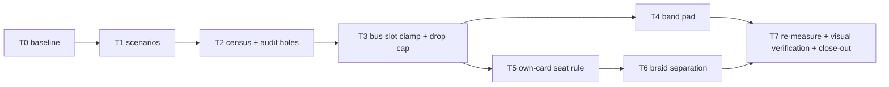

# Chip Seating F1+Z2 Implementation Plan

> **For agentic workers:** REQUIRED SUB-SKILL: Use superpowers:subagent-driven-development to implement this plan task-by-task. Steps use checkbox (`- [ ]`) syntax for tracking.

**Goal:** Fix the F1 (chips ride onto cards) and Z2 (corridor braids / stranded bus chips / band escapes) seating families from the 2026-08-22 render exam, and land a bus-chip-inclusive seating census ratchet so the fixes are measurable and cannot regress.

**Architecture:** All changes live in the layout/seating passes (`src/canvas/busRouting.ts`, `src/canvas/chipSeating.ts`) and the e2e audit (`test/e2e/collect.ts`, `test/e2e/geometry.ts`, `test/e2e/geometry-audit.spec.ts`, `test/e2e/scenarios.ts`). Rendering components are untouched. Three root causes drive all defects: (1) bus rise-chip slots are spread across the whole trunk extent in edge-id order with no reference to the member's own lane run (`busRouting.ts:557-581`), and no later pass corrects them against the resolved columns; (2) the 48px junction-dot cascade lift puts a lifted chip box outside a band whose pad only covers unlifted chips (`busRouting.ts:638`, guard at `chipSeating.ts:1665-1669`); (3) the tier-1b graze scorer's only objective is `foreignLineCrossings`, so it rewards card-hugging and cannot distinguish a coincident foreign stroke from a distant one (`chipSeating.ts:832-869`, own-card centre rule `chipSeating.ts:266-279`).

**Tech stack:** TypeScript, vitest (unit), Playwright e2e (local only, not in CI), bun scripts.

**Background dossiers** (read before implementing; in this worktree, gitignored):
- `.superpowers/sdd/explore-code.md` - pipeline map, root causes with file:line, feasibility notes, landmines.
- `.superpowers/sdd/explore-evidence.md` - exact defect instances (edge ids, world coords, distances), corpus census, confirming PNGs under `../develop/.artifacts/exam-zh/`.
- `.superpowers/sdd/plan-audit.md` - audit findings folded into this revision; its RISKS section is binding implementer context, referenced per task as A-R1..A-R20.

## Global Constraints

- All distances in this plan are **world px** unless stated. The exam prose used screen px at zoom 0.75 (multi6's "306px" = 407.9 world). The evidence dossier's chip boxes were measured at capture counter-scale 1.333; the census camera (zoom 0.6) draws boxes 25% wider - offline seeds are approximations, never acceptance values (A-R14).
- `PORT_DRIFT` stays in `chipSeating.ts` only; `busRouting.ts` stays model-frame throughout.
- ASCII-only comments in source. Never paste NBSP or other invisible characters.
- Gates before any "done" claim: `bun run typecheck`, `bun run lint`, `bun run test` (vitest), and the geometry-audit e2e suite against the Task 0 expected-red baseline.
- Ratchet discipline: a pre-existing pin may only move DOWN silently; an UP move on a pre-existing pin needs a ruling recorded here and in the spec's NOTE block. Pins first recorded by THIS campaign (Task 1/2) may be re-measured freely inside the campaign with an annotation of cause - they are measurements, not rulings (A-R20).
- 3.2GB-RAM box: wrap builds/e2e in `systemd-run --user --scope -p MemoryMax=2200M --quiet`; build first, `vite preview` in background, `reuseExistingServer` picks it up; one scenario per playwright invocation for heavy captures (the 3 new scenarios add ~13 e2e cases + 3 screenshot baselines - generate one at a time, A-R19); never `pkill -f "vite preview"`.
- Commit per task, imperative single-line messages, no external-doc references in messages or comments.

## Rulings (decided for this campaign; final review may challenge)

- **R1 - No foreign-card work.** Evidence shows 0 foreign-card chip overlaps corpus-wide; all card overlaps are own-card. The hard `entersForeignCard` tier and the e2e tier-4 HARD-ZERO gate are untouched.
- **R2 - Twin-text ambiguity is out of scope.** gas-web's two "30/分" chips are both at 0.00 from their own lines; identical icon+rate text is a label-content problem for the Z5 campaign. This campaign fixes seat geometry only.
- **R3 - Bus slot clamp over trunk spread.** Fix strandings by clamping each member's slot into its own resolved run, in the seating pass where resolved columns exist. More capacity hides are acceptable: a hidden chip keeps its rate on the target card's input row and hover/tooltip. Expected concretely: multi6's 10-member water trunk has ~259u own runs vs `MIN_CHIP_SEP` 240, so most of its rise chips will hide - that is the intended trade, not a regression (A-R2).
- **R4 - Band fix is the constant pad**, written in `busRouting.ts`'s own vocabulary as `LANE_SPACING + (MAX_CHIP_SCALE * CHIP_BOX_HEIGHT) / 2` (= 72; do NOT import `CHIP_PITCH_Y`/`CHIP_HALF_H` from `chipSeating.ts` - import cycle, A-R4). Coverage is boundary-touching at exactly one cascade pitch, so containment tests must be inclusive (A-R5).
- **R5 - Item-chip escape tiers stay.** Do not hide item rate chips (history: #39/#45; issue-#9 orphaned-chip regression). Off-path item chips stay visible and are counted by the census.
- **R6 - Census camera is a fixed reading zoom via the exam hook.** The census loads `/?exam=1#<hash>` (query BEFORE fragment), waits for `window.__stcExam`, calls `__stcExam.setViewport({x, y, zoom: 0.6})`, then re-runs `waitForStableViewport`. 0.6 is above both LOD gates (0.35/0.32) so every chip is drawn; React Flow has no visibility culling here so off-viewport elements still measure (audit-verified). Page-level `setViewport` does not exist - do not invent one.
- **R7 - Drop-chip cascade is capped, not hidden.** The drop chip is deliberately zoom-gate-exempt (`BusEdge.tsx:119-124`) - it is a lone trunk's only fit-zoom-visible rate, and no `busDropHidden` plumbing exists. So: cap its cascade at one pitch (|dy| <= 48) and, within the cap, relax obstacles in softness order (foreign lines soft; dots softest). The cap is SOFT against placed chips only: if no |dy| <= 48 seat clears placed chips, the cascade may exceed one pitch rather than overlap a chip (chip-vs-chip stays hard - the P1 zero-overlap gate depends on it). That escape hatch is expected to fire zero times in-corpus; any firing shows up in the outside-band census counter and gets recorded. No hiding, no new data fields.
- **R8 - Own-card intrusion is a two-level soft rule, not a hard block.** Tier-1 slide treats an over-budget intruding candidate as not-clear (walks past it); the graze tier scores intrusion as a soft penalty between crossings and dots. It never blocks nudge/escape and never applies to foreign cards (those stay hard). This avoids the issue-#9 blowback the source records at `chipSeating.ts:246-247` (a hard box rule flings short-leg chips into escape - the exact at-risk seats are script43 e:31/e:33/e:32/e:21 and gas-web e:25/e:17/e:18, A-R8).
- **R10 - Card-intrusion residue is structural; Task 5 is judged on the deep class.** (Added after Task 2 review.) The census card-intrusion counter is a BOX-depth rule while the seating exemption is a CENTRE rule - same number (9), different rule - so shallow centre-legal seats (box wider than the corridor) can never reach zero. Task 5's acceptance: the deep class (intrusions saturating at the full chip extent - chips a reader sees ON the card, 21 cases at Task 2 baseline) reaches zero or an enumerated residue, AND the total drops; the counter's comment must not claim rule-parity with `chipEntersOwnCardBody`.
- **R11 - Depth-above-crossings flip REJECTED; realistic seat box is the F1 lever.** (Added after Task 5 review.) Task 5 proved the 21 deep on-card seats are availability-bound: no within-budget clear on-line candidate exists for them under the reserved 240x48 box. Flipping the ranking (depth above crossings) was measured (deep 21->2, but foreign-stroke +19 concentrated on the same chips, one default-plan rate chip silently hidden, seat-validity +1) and rejected: it trades a legible-but-ugly defect for ownership ambiguity and inverts the precedence Task 6 assumes. Revisit only behind four gates recorded in the Task 5 review. Instead, Task 6b (below) narrows the RESERVED seat box toward a locale-safe upper bound on the drawn width. Corrected by the T6b audit: the "drawn 135" figure was census-camera scale 1.667; the seat invariant holds at scale 2, so the sound reserve for that chip is ~162 - which still fails the 153-unit corridor. The gain is the text slack (typically 240 -> ~189, zero for chips at the 120px CSS clamp), so Task 6b SHRINKS the deep class with an enumerated residue; it cannot promise closing it.
- **R9 - Seat-validity is structural.** The census seat-validity criterion is "own edge's polyline intersects the drawn chip box" (e2e analogue of `segIntersectsChipBox`), NOT a centre-distance rule. A sidestep seat keeps its line in the box by construction and must count as valid, or Task 6 red-flags its own fix (audit B8).

## Task order and dependencies

T0-T2 land the measurement surface BEFORE any fix so every fix task shows a measured before/after on the same pins.

---

### Task 0: Baseline the e2e failure list

**Files:** none (measurement only; record in `.superpowers/sdd/progress.md`).

**Requirements:**
- Build once, run the full e2e suite on this branch untouched, and record the complete failure list. Prior campaigns measured expected-red as MORE than the one ratified failure (battery5 + multi6 RAW, inputs-panel pins, a rotating placement-shots flake - see the NOTE block and `docs/plans/2026-08-08-chip-seating-saturated-zoom.md`); do not assume "exactly one red" (A-R18).
- This list is the campaign's expected-red baseline: later tasks compare against it, not against an assumed set.

**Acceptance:**
- [ ] Failure list recorded in the progress ledger with test names.

### Task 1: Register the three v1.4 scenarios

**Files:** `test/e2e/scenarios.ts` (append), `test/e2e/geometry-audit.spec.ts` (add keys to all seven baseline tables).

**Requirements:**
- Append three `Scenario` entries - fields `id`, `title`, `targets`, `maxDiffPixels` (`scenarios.ts:17-29`); rates are per-second rationals with the per-minute figure in a trailing comment, matching file convention:
  - `script43`: `equip_script_4_3` `{1,2}` (30/min).
  - `coupon-web`: `jinlong_coupon` `{1,1}` (60/min), `filter_core` `{1,4}` (15/min), `copper_jar` `{1,2}` (30/min).
  - `gas-web`: `gas_xiranite_enr` `{1,2}` (30/min), `gas_copper_enr2` `{1,2}` (30/min), `gas_inert` `{1,4}` (15/min).
- Ids exactly `script43`, `coupon-web`, `gas-web` (match the exam corpus). Update the file-header comment ("seven placement-regression scenarios" is now stale). Pick `maxDiffPixels` by density per the file's existing tiers.
- No hash literals, no committed goldens (screenshots are gitignored; first local run writes them).
- All seven baseline tables (`CROSSING_BASELINE` :375, `PADDED_GRAZE_BASELINE` :412, `CHIP_SEGMENT_BASELINE` :479, `CHIP_OFFPATH_BASELINE` :528, `OWN_PIERCE_BASELINE` :558, `DOT_COVER_BASELINE` :603, `ENDPOINT_PARITY_TOL` :643) get a key per new scenario, else the spec throws on `undefined!`. Values are MEASURED (run the audit, record what it reports), annotated as first recordings per the NOTE-block convention.
- Watch the hard tier-1 RAW zero gate: if a new scenario lands a RAW pierce, that is a hard failure needing investigation (against the Task 0 baseline), not a pin.

**Acceptance:**
- [ ] `bun run typecheck` + `bun run lint` clean.
- [ ] Geometry-audit e2e green for the three new scenarios with the recorded pins; existing scenarios' pins untouched; failure set == Task 0 baseline.
- [ ] `placement-shots` produces goldens locally for the three ids (one scenario per invocation).
- [ ] Commit.

### Task 2: Close the bus-chip audit hole and add the seating census

**Files:** `test/e2e/collect.ts` (bands), `test/e2e/geometry.ts` (census functions), `test/e2e/geometry-audit.spec.ts` (new describe + baseline tables).

**Requirements:**
- Extend `collectGeometry` (`collect.ts:204-286`) with a `bands` array: query `.bus-band`, read `data-testid` (`bus-band-top|bottom`), map client rects through the same `toGraphX/toGraphY` as the other rects. Bands exist only in `collectScene` today - the census needs them in the geometry collector (audit B2).
- New census criterion in its OWN describe with its OWN page load (the P2 describe's criteria all measure at fit zoom and `auditDotsUnderChips` consumes `geom.zoom`; a mid-test camera change would corrupt them, A-R17). Camera per ruling R6, incl. the `ExamWindow` type declaration pattern from `tools/exam/probe.ts:89-90`.
- Four counters, ALL chip kinds (label, bus, bus-drop) unless stated:
  - **seat-validity** (R9): own edge's polyline does NOT intersect the drawn chip box (structural; `segmentEntersRect` exists in `geometry.ts` as the analogue of `segIntersectsChipBox`).
  - **card-intrusion**: chip box intrudes more than `CARD_BORDER + PORT_ZONE_DEPTH` (9) DEPTH past any node card's border (own included; `loop:` slabs excluded) - a depth rule, not an area rule, so it shares Task 5's budget and port-strip-legal seats never count (an area threshold cannot express that: a legal 9px-deep strip seat is already ~432 px^2 at max scale). Note the e2e tier-4 centre-rule gate is a DIFFERENT criterion and stays untouched.
  - **foreign-stroke**: chip box intersects a polyline of a foreign flow. MUST reuse the same foreignness waivers as `auditSegmentsVsChips` (`geometry.ts:384-430`: own edge skipped, same item+source flow waived, same-target entry-band waived) so this counter and `CHIP_SEGMENT_BASELINE` cannot move in opposite directions for the same seat (A-R16); the delta is that this counter also covers bus chips.
  - **outside-band**: bus chips whose box lies fully outside their band rect, bound to top/bottom by the chip's lane y, not nearest-rect (audit B2). Count vertical escapes; report x-overflows separately (A-R6).
- Per-scenario baseline table + corpus-wide total, pinned at measured values on THIS commit (pre-fix). Offline seeds (different camera, 8-plan corpus) suggest magnitudes ~33 / ~50 / ~77 / ~14 but the census camera draws boxes 25% wider and covers 10 plans - record actuals; investigate a counter only if >2x off its seed (A-R14, A-R15).
- Failure messages name offending chip element ids (existing table style).

**Acceptance:**
- [ ] New criterion green with measured pins on all 10 scenarios.
- [ ] Existing criteria untouched (same pins; failure set == Task 0 baseline).
- [ ] Commit.

### Task 3: Clamp bus rise slots into their own resolved run + cap the drop cascade

**Files:** `src/canvas/chipSeating.ts` (lane-bus phase `:1516-1529` clamp, stamp block `:1950-1995`, drop seat `:1562-1574`), `src/canvas/busRouting.ts` (stale comments `:527-539`, capacity-hide rationale comment in `chipSeating.ts:1583-1588`), unit tests (`test/canvas/busRouting.classify.test.ts`, `test/canvas/chipSeating.seat.test.ts` or siblings).

**Requirements:**
- **Clamp location is the seating pass, not `routeBusEdges`** (audit B4): at `chipSeating.ts:1516-1529` the member's RESOLVED `{dropX, riseX}` come from `chamferBusPath(...routingHintsFromData(edge.data))` - post-`assignEntryColumns`/`clearBusColumns`, so the drawn run is exact (the base columns can be dodged ~370px later; a chamfer of slack at `busRouting.ts:557` cannot hold the invariant).
- Clamp each member's `riseChipX` into `[min(dropX, riseX) + slack, max(dropX, riseX) - slack]` with chamfer-scale slack; when the interval collapses (`max - min <= 2*slack`), use the run midpoint (audit B5 - backward/degenerate members like multi6 e:108 have riseX < dropX). The clamp is per-member and order-independent - do NOT re-sort slot assignment in `busRouting.ts` (keeps the documented shuffled-input determinism contract and its pinned test, audit B6). Slot collisions after clamping resolve through the existing capacity hide.
- **Stamp the corrected x back onto edge data as `busChipX`** (stamp block `:1950-1995` already merges bus fields) so `BusEdge.tsx:252` and `contentBounds` (`:2134`) draw and frame the same x. The stamp block's early-return guard (`:1964-1982`) currently skips edges with nothing to stamp - extend it so a newly-clamped `busChipX` actually lands, or the clamp is a silent no-op. The lone-long-run member skips the CLAMP entirely (not just the stamp) so `busChipX === undefined` is preserved (`BusEdge.tsx:143-152` keys its zoom-gate exemption on that).
- Capacity hide (`:1589-1616`) now reads clamped positions; its keep-order comment ("farthest slot from the junction") becomes "longest own run" in effect - update the comment (A-R2). Heavy hiding on short-run trunks is intended (ruling R3).
- **Drop cascade cap per ruling R7:** the lone-trunk drop chip's `seatChip` cascade is capped at one pitch; within |dy| <= 48 relax dots first, then foreign lines; chips stay hard. No hide, no new data fields.
- Update stale prose: `busRouting.ts:527-539` module comment describes the old spread-only semantics.
- Unit tests: (a) clamp-into-own-run across a multi-member trunk incl. one backward member (riseX < dropX -> midpoint); (b) drop cascade never exceeds one pitch when a within-cap seat exists, preferring dot-overlap over exceeding it; (c) lone long-run member still has `busChipX === undefined`. `busRouting.classify.test.ts` stays GREEN UNMODIFIED - `routeBusEdges` is behaviourally untouched by this task (the clamp lives in the seating pass); an implementer editing those tests to pass is a red flag, not a re-pin.

**Acceptance:**
- [ ] Unit tests green (`busRouting.classify.test.ts` and its shuffled-input determinism test pass unmodified).
- [ ] Census seat-validity drops sharply; record actuals, ratchet the campaign pins down.
- [ ] Fit-zoom / LOD cascade check: full audit run; any moved pin in the seven existing tables re-measured and recorded with a one-line cause (`contentBounds` shrink is expected; more drawn chips after a fit-zoom rise is the known cascade, A-R3). Failure set compared against Task 0 baseline.
- [ ] Visual spot-check on multi6 (e:108 area) and script43 trunk: no stranded bus chips.
- [ ] Commit(s) - clamp and drop-cap may be separate commits.

### Task 4: Band pad covers lifted chips

**Files:** `src/canvas/busRouting.ts` (`BAND_Y_PAD` `:638` + comment `:633-638`), affected tests.

**Requirements:**
- `BAND_Y_PAD`: `LANE_SPACING / 2` -> `LANE_SPACING + (MAX_CHIP_SCALE * CHIP_BOX_HEIGHT) / 2` (= 72), expressed exactly so - both operands already in scope in `busRouting.ts` (imports `:24-31`, `LANE_SPACING` `:87`); do not import from `chipSeating.ts` (cycle, A-R4).
- Correct the comment at `:633-638`: the pad now covers chips lifted up to one cascade pitch, inclusively (boundary-touching at exactly one pitch - containment assertions must be inclusive, no eps margin, A-R5).
- Depends on Task 3's drop cap: with kept bus chips within one pitch of the lane (the R7 soft-cap escape hatch expected to fire zero times in-corpus), 72 covers every kept chip box; a chip-forced overflow, if one ever appears, is caught by the outside-band counter and recorded rather than papered over.
- Update census outside-band pins: expect 0 VERTICAL escapes; the one known x-overflow (multi6 e:3-rise, 25px past band right) is tracked separately and may or may not clear via Task 3 (A-R6).

**Acceptance:**
- [ ] Census outside-band vertical escapes = 0, pins updated; x-overflow status recorded.
- [ ] multi6 top band tint does not touch the nearest node row (8px margin under `LANE_TOP_OFFSET` 80) - screenshot check.
- [ ] Commit.

### Task 5: Own-card intrusion - seat-side predicate and graze penalty

**Files:** `src/canvas/chipSeating.ts` (new predicate near `:266-279`; tier-1 clear check; graze scoring `:832-869`), unit tests (`test/canvas/portZoneDepth.test.ts`, `test/canvas/chipSeating.seat.test.ts` - both pin the CURRENT centre semantics and must keep passing for the shared helper).

**Requirements:**
- **Do NOT touch `chipEntersOwnCardBody`** - it is imported verbatim by `test/e2e/geometry.ts:22` and backs the tier-4 HARD-ZERO e2e gate plus two pinned unit surfaces (audit B3). Add a SEPARATE seat-side predicate (e.g. `chipIntrudesOwnCard`) consumed only by the seating pass.
- Define ONE chip box for the predicate, derived from constants (e.g. half-extents from `CHIP_BOX_WIDTH/HEIGHT` and `MAX_CHIP_SCALE`), not from exam measurements (the "55x24" evidence box was camera-specific, A-R10); document the choice where the census can mirror it.
- Two-level application per ruling R8:
  - Tier-1 slide: an over-budget intruding candidate is not-clear -> the slide walks past it (budget: box intrusion beyond `CARD_BORDER + PORT_ZONE_DEPTH` past the card border; the port-strip stays legal).
  - Graze tier: intrusion is a scored penalty, precedence (foreignLineCrossings, cardIntrusion, dotsCovered). The graze early-exit condition (`:838-843`, stops at score 1 with no dots) MUST be extended to the new term or it never compares (A-R9).
  - Never blocks nudge/escape; foreign cards stay hard everywhere.
- Known worst instances to verify before/after: multi6 e:30 (q:22), battery5-xiranite e:18, script43 e:31/e:21/e:33/e:32 tap cluster, gas-web e:25/e:17/e:18. These same tap seats are the escape-blowback risk (A-R8): after the change they must seat ON-LINE with reduced intrusion, not fall to nudge/escape - assert via the census (seat-validity must not rise).
- Landmines: `CHIP_SEGMENT_BASELINE` can move both directions; battery5-xiranite pin encodes a ratified trade (`geometry-audit.spec.ts:466-478`) - if reached, re-derive and record. Fan-in seam (`FANIN_EPS = 1`, saturated) can flip on any seat motion - run `faninMarkers.test.ts`. The tier-1 intrusion check also changes when tier 1c (sidestep) fires, so this task can move chip x-positions before Task 6 lands - attribute census movement accordingly.
- Unit tests: boundary of the new predicate (9px-past-border legal, beyond rejected in tier-1), graze tie broken away from a card, and existing centre-rule pins untouched.

**Acceptance:**
- [ ] Census card-intrusion: deep class (full-extent saturations, 21 at Task 2 baseline) -> zero or enumerated residue, total drops; pins ratcheted down to actuals (ruling R10).
- [ ] Census seat-validity does NOT rise (no escape blowback).
- [ ] All unit + e2e green vs Task 0 baseline; moved pins recorded with causes.
- [ ] Commit.

### Task 6: Braid separation - own-line binding term and scored sidestep

**Files:** `src/canvas/chipSeating.ts` (ClearanceField window API `:295-409`, graze tier `:832-869`, sidestep `:792-812`), unit tests.

**Requirements:**
- ClearanceField gains a window-returning method (per-edge clipped segment window inside a candidate box) routed through the SAME `isForeignEdge`/`clusterExemptOf` pair as the counting predicates, preserving the documented "zero iff onForeignLine false" invariant (A-R13). The own line needs no new API - `seatRateChip` already holds `pts`.
- Graze scoring gains an own-line-binding penalty: a candidate whose box contains a foreign-flow stroke within 8 world px of the own stroke's crossing is penalized, precedence (crossings, cardIntrusion, binding, dots). Extend the early-exit condition accordingly.
- Scored sidestep inside the graze tier, gated on a DETECTED coincident foreign stroke (cost control: the graze walk is ~97 candidates x every segment; an ungated 16-offset sidestep scan is ~16x inside a synchronous pass, A-R12). The scorer must be able to prefer the FAR offset: with a 3px column and half-width 55, only the flush final step (offset 52-55) clears the foreign stroke - nearest-first ordering kills the fix (A-R11). Keep sidestep's box-contains-own-line invariant.
- Do NOT implement the leader tick; if score-based separation leaves the script43/gas-web columns ambiguous, stop and record a ruling request for the final review.
- Known instances to improve (verify): script43 column x~3058 (e:10/e:30/e:15 - salmon chip on green strokes), gas-web column x~2488 (e:3/e:28/e:5). Exactly-coincident-everywhere pairs (multi6 e:23/e:27, e:40/e:42; gas-web e:28-vs-e:3) CANNOT clear by seat choice - expected residual, record it.
- Unit tests: binding penalty ranks a clean candidate above a coincident one; sidestep fires only under coincidence and can select the far offset; determinism (same input, same seats).

**Acceptance:**
- [ ] Census foreign-stroke count drops (record actuals); pins ratcheted down; residual coincident class enumerated.
- [ ] script43 capture: salmon 150/分 chip no longer sits on the green stroke.
- [ ] `CHIP_SEGMENT_BASELINE` moves re-measured and recorded; `faninMarkers.test.ts` green.
- [ ] Commit.

### Task 6b: Realistic per-chip seat box (added by ruling R11)

**Files:** `src/canvas/chipSeating.ts` (seat half-width derivation, `CHIP_HALF_W_WIDE` consumers in `seatRateChip` callers), possibly `src/canvas/ItemEdge.tsx`/`BusEdge.tsx` only to READ how drawn width is derived (no render changes), unit tests.

**Why:** the seating pass reserves `CHIP_HALF_W_WIDE = 120` (240 wide, worst case at max counter-scale) for every non-icon chip, while the deep-class chips draw 135-200 wide. The corridor is blocked only for the SEAT, never for the reader. Narrowing the reserved box to a per-chip realistic width frees clear on-line candidates and closes the deep class without buying crossings (proof: battery5-xiranite e:11).

**Requirements (as corrected by the T6b audit, .superpowers/sdd/plan-audit-t6b.md - read it first):**
- Estimator (audit-recommended): `MAX_CHIP_SCALE * min(CHIP_BOX_WIDTH, 38 + 7.5*bodyChars + UNIT_MAX_PX) / 2` where 38 = sprite 16 + gap 6 + padding 14 + border 2 (from `.flow-chip` CSS, `canvas.css:1746-1791`), `bodyChars` counted from the string the pass reproduces exactly via `formatRatePerMin` on edge data (`rate` / `busTotalRate` / `busMemberCount`), and `UNIT_MAX_PX = 34` a locale-independent constant covering the WIDEST locale unit (en `/min` / ru; zh `/分` is the narrowest - the original zh premise was backwards; 0 for digits-only share chips; the 共-total is aria-only, never drawn). The layout pass MUST stay locale-independent (`layout.ts:281-282` pins this) - never read the active locale.
- Change ONLY the `seatRateChip` half-width consumer (`chipSeating.ts:823` halfW): `contentBounds` (`:2285`) and `MIN_CHIP_SEP` (`:1779`) STAY at `CHIP_HALF_W_WIDE` - narrowing contentBounds triggers the fit-zoom/LOD cascade and narrowing MIN_CHIP_SEP reverses ruling R3's hides. Fallback `CHIP_HALF_W_WIDE` when no rate is available.
- In-scope decision (decided): item chips stamped `chipIconOnly` currently reserve 240 while drawing 48 - give them the `CHIP_HALF_W_ICON` reserve (this was already a recorded follow-up candidate from the prior seating campaign). Attribute their census movement separately.
- Hover re-expansion stays out of scope: the invariant is defined at rest, matching the existing icon-only precedent.
- Landmines: every census counter and `CHIP_SEGMENT_BASELINE` can move; fan-in seam (`faninMarkers.test.ts`); the Task 5 tier-1 drift finding shrinks as chips gain within-budget candidates - re-measure, add the distance pin if drift instances remain.
- Deep-class measurement recipe (the class is prose, not code): force the census card-intrusion cells to -1, count reported depths >= 39.5, compare instance sets against Task 5's enumeration.
- Locale verification: a Playwright check (probe.ts has --locale and --eval; jsdom stubs offsetWidth so vitest cannot do this) over all four locales (zh/en/ja/ru) asserting drawn `offsetWidth <= estimator's natural width` for a sample of chips on 2-3 plans.

**Acceptance:**
- [ ] Deep class shrinks with per-instance enumeration of the remainder (no closure promise); card-intrusion total drops from 84; seat-validity and foreign-stroke do not rise; pins ratcheted with causes.
- [ ] Four-locale width-bound check green.
- [ ] All gates green vs Task 0 baseline; moved pins recorded with causes.
- [ ] Commit.

### Task 7: Full re-measure, visual verification, close-out

**Files:** `test/e2e/geometry-audit.spec.ts` (final pins + NOTE entry), goldens (local), `.artifacts/` captures (gitignored).

**Requirements:**
- Full gate run: typecheck, lint, vitest, complete geometry-audit suite, placement-shots regenerated (one scenario per invocation). Failure set == Task 0 baseline (any delta explained and either fixed or ratified).
- Final census table recorded with post-campaign pins; NOTE block gets one entry summarizing this campaign's pin movements and rulings R1-R9.
- Visual verification per the mandatory protocol: default-plan captures + zoomed crops of every named defect site (multi6 e:108/e:30, battery5 e:16 float, script43 column + tap cluster + band, gas-web column, coupon-web e:13) at reading zoom; inspect for WRONGNESS not presence. Store under the worktree `.artifacts/seating-verify/`.
- Confirm the two ratified item-chip escapes (battery5 e:18/e:1) still render as before (R5).

**Acceptance:**
- [ ] All gates green vs Task 0 baseline.
- [ ] Every Task 3-6 before/after documented in the progress ledger with pin numbers.
- [ ] Plan checkboxes all ticked; commit close-out.

---

## Out of scope (recorded so reviewers know it was seen)

- Twin-text disambiguation (R2) - Z5 campaign.
- Leader tick render element - only on ruling if T6 leaves ambiguity.
- Item-chip escape-tier hiding (R5) and drop-chip hiding (R7).
- `loop:` slab straddles (4 instances) - separate family (Z6 loops).
- Fan-in mixed-frame stamp, cards[]-to-drawn-frame migration, per-edge endpoint-parity ratchet - pre-existing deferred follow-ups, unchanged.
- The lane-bus phase's model-frame seam (seat box 4-5px left of drawn chip when no hint stamped) - largely superseded by T3's resolved-column clamp; re-check after T3 and note the residual.
- multi6 e:3-rise 25px x-overflow past band right (`BAND_X_MARGIN`) - tracked, fixed only if T3 clears it incidentally.
