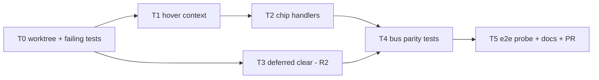

# Chip Hover Binding Plan (#57)

> **For agentic workers:** REQUIRED SUB-SKILL: Use superpowers:subagent-driven-development to implement this plan task-by-task. Steps use checkbox (`- [ ]`) syntax. Read the Rulings section before starting; both rulings were made on 2026-09-07 and are final for this plan.

**Goal:** Give every rate chip the same hover behaviour as the edge stroke it labels. Point at a chip that sits in a coincident column (a braid, or a foreign stroke through its box) and its owner lights up: the owning edge lights and the rest dim, the same way hovering the stroke does. Moving between a stroke and its own chip never flickers.

**Architecture:** One render-layer change and one hover-timing change. A small canvas context carries the existing hover scheduler to the portaled chip component, and the chip gains enter/leave handlers keyed on the `edgeId` it already owns. Bus chips need no special case, since each already carries its member edge id and the two-mode trunk focus then comes out of the existing focus computation. The leave path becomes a short deferred clear so a chip enter can cancel the stroke leave. No seating, routing or static-ink change.

**Tech stack:** TypeScript, React context, vitest (jsdom) for the focus set, one Playwright hover probe (local only, e2e is not in CI).

## Rulings

- **R1 - Hover-only cue (2026-09-07).** No leader tick, no owner rim, no static ink. The cue is invisible in exam captures by design; the exam corpus keeps parking the pointer off-graph.
- **R2 - Deferred clear (2026-09-07).** Node and edge leave schedule the clear on the same intent timer; a following enter cancels it. Pane click still clears immediately. Un-dim after leaving the graph entirely is delayed by up to one intent window.
- **Re-scope of #57.** Item 3 of the issue (multi6 seat-validity adjudication) is obsolete: the cell is pinned at 0 since PR #102. The per-chip scale cap already covers item 2 (chip width vs frame), and the census frame stays at the fixed 0.6 zoom, so there is no work here. Only item 1 remains, and this plan is it.

## Evidence (develop@6706c7e)

- Hover state and scheduler: `src/canvas/Canvas.tsx:213` (state), `:354-367` (`scheduleHover` behind `HOVER_INTENT_MS` at `src/canvas/dimensions.ts:132`, `clearHover` immediate), `:382-395` and `:576-580` (node/edge/pane handlers), `:375-377` (plan swap cancels a pending hover).
- Focus set: `Canvas.tsx:449-517` over the adjacency index at `:106-112` and `:422-447`; bus two-mode split on `trunkKey` at `:481-512` (owner lights the trunk, branch lights branch plus owner). Stamping via exported `focusEdges` at `:138-159`; container class at `:562`.
- Dim CSS: `src/canvas/canvas.css:1313-1322` (node/edge), `:1325-1332` (gas floor), `:1342-1362` (lit stroke and gas dash), `:1753-1760` (portaled chips), `:1777-1779` (junction dots).
- Chips: `FlowChip` at `src/canvas/ItemEdge.tsx:208-300`, rendered through `EdgeLabelRenderer` (a portal, so dim is threaded through `data.dimmed` at `:82-88`); `pointer-events:auto` at `canvas.css:1710-1712` with a unit pin at `test/canvas/ItemEdge.test.tsx:107`; `edgeId` emitted as `data-edge-id` at `ItemEdge.tsx:222-224,276`; `iconOnly` collapse gated on `focused` at `:267-271`. Call sites `ItemEdge.tsx:740-754` and `src/canvas/BusEdge.tsx:306-329,376-390` (owner drop chip and member rise chip both pass the member edge id).
- Context precedent: `src/canvas/itemPackContext.tsx:11-32`.
- Existing tests: `test/canvas/focus-dim.test.tsx` (node/edge/trunk sets, chip dim `:205-235`, leave `:195`, pane click `:245`, two-mode trunk `:305-375`, pure `focusEdges` `:377-398`); `src/canvas/Canvas.test.tsx:234-380` (intent delay, cancel, plan swap); e2e hover harness `test/e2e/gas-transport.spec.ts:114-165`; pointer parking `test/e2e/drag-reseat.spec.ts:66-72`.
- Why PR #86's crossing cue does not cover this: `src/canvas/crossings.ts:22-30` requires a proper interior crossing; braids are collinear and only touch.

## Global Constraints

- Branch `fix/chip-hover-binding` off `develop`, worktree `STC/.claude/worktrees/fix/chip-hover-binding/`. Never switch the main checkout.
- Nothing reaches GitHub except the PR. Read-only `gh` is fine.
- No seating, routing or CSS geometry change. `chipSeating.ts`, `busRouting.ts` and the geometry-audit baselines must be untouched; if a pin moves, stop and report.
- Prop-drilling the setter through `EdgeProps.data` is forbidden: `focusEdges` rewrites `data` and would churn identity. The context value must be memoized so chips do not re-render per frame.
- ASCII-only comments. No external-doc references in comments or commit messages.
- 3.2 GiB box: wrap bun/vitest/playwright in `systemd-run --user --scope -q -p MemoryMax=2G -p MemorySwapMax=512M -- bun --smol ...`; vitest as ten sequential shards; one playwright spec per invocation.
- Gates before "done" on any task: `bun run typecheck`, `bun run typecheck:tools`, `bun run lint`, sharded `bun run test`.

## Outcome (2026-09-07)

**The premise was false.** Rate chips already bind hover to the edge they
label, on develop as it stands. Two independent verifications landed on the
same mechanism: React Flow attaches the edge hover handlers as JSX props on the
edge `<g>`, `EdgeLabelRenderer` is a `createPortal`, and React synthesizes
`mouseenter` / `mouseleave` by walking the fiber tree, whose parent chain
crosses a portal. A chip fires its own edge's `onMouseEnter` with its own edge
id, for free. Both `FlowChip` call sites sit inside their own edge component, so
bus drop and rise chips resolve to the member edge and the two-mode trunk focus
applies unchanged. Travel from a stroke to its own chip fires no leave at all,
because the shared fiber ancestor sits at or below the edge `<g>`.

Nothing guarded that, though. It falls out of the render shape, and hoisting
chips into a top-level layer would sever the fiber chain without one test going
red.

**Delivered instead.** Regression pins in `test/canvas/focus-dim.test.tsx`
covering stroke parity on an item edge, a chip crossed by a collinear foreign
stroke, bus drop and rise parity, and the no-leave travel under fake timers;
one Playwright probe in `test/e2e/chip-hover.spec.ts`; one sentence in
`docs/render-conventions.md`.

**Dropped.** Task 1 (hover context) and Task 2 (chip handlers). There is nothing
to wire; the handlers already fire.

**Withdrawn.** Task 3 and ruling R2, the deferred clear. Its stated motivation
was flicker on stroke-to-chip travel, and that travel fires no leave, so there
is no flicker there to fix. What remains is a different complaint: a pointer
that detours across the pane between a stroke and its chip, and edge-to-edge
travel generally, both of which pay the intent window again. Whether that is
worth a deferred clear is its own question and wants its own ruling before any
work starts.

**Closing note for #57.** Item 1 is satisfied by the code as it stands and is
now guarded. Item 2 is covered by the per-chip scale cap. Item 3 is obsolete
since PR #102 pinned the multi6 seat-validity cell at 0.

## Task order and dependencies

### Task 0: Worktree and red tests

- [x] Create the worktree and branch.
- [ ] Add failing tests in `test/canvas/focus-dim.test.tsx`: mouse-enter on a rate chip test id yields the same dimmed/lit sets as mouse-enter on its stroke; mouse-leave from the chip clears; a chip in a two-edge braid lights only its own edge.
- [ ] Add a failing timing test in `src/canvas/Canvas.test.tsx`: stroke leave immediately followed by chip enter on the same edge produces no frame where the focus set is empty (fake timers).

**Acceptance:** the new tests fail for the stated reason (no handlers, immediate clear), everything else green.

### Task 1: Hover context (dropped)

- [ ] Add a canvas hover context (same shape as the item-pack context) exposing enter-edge and leave callbacks bound to the existing scheduler and clear. Provide it inside `CanvasInner` around the `ReactFlow` element.
- [ ] Short-circuit the scheduler when the settled hover already equals the target, so chip-to-stroke travel within one edge never re-times.

**Acceptance:** no behaviour change yet; existing focus-dim and Canvas tests green; the context value is referentially stable across re-renders (assert with a render-count or identity test).

### Task 2: Chip handlers (dropped)

- [ ] `FlowChip` consumes the context and wires enter/leave on its root element using its `edgeId`. No new props at the call sites beyond what the context supplies.
- [ ] Keep `nodrag nopan` and `pointer-events:auto` as they are. The `focused` prop keeps driving the collapsed-chip expansion; no separate chip-focus flag.

**Acceptance:** Task 0's chip tests pass for item-edge chips. `test/canvas/ItemEdge.test.tsx:107` pointer-events pin still green.

### Task 3: Deferred clear (R2) (withdrawn)

- [ ] Route node and edge leave through a scheduled clear on the hover timer; a subsequent enter (stroke, node or chip) cancels it. Pane click and plan swap keep clearing immediately.
- [ ] Decide the grace value in `dimensions.ts` next to `HOVER_INTENT_MS`; it must be at most the intent delay so the total un-dim latency is bounded.

**Acceptance:** Task 0's no-flicker test passes; `focus-dim.test.tsx:195` (leave) and `:245` (pane click) still pass, adjusted to advance timers where the leave path is now deferred; `Canvas.test.tsx` plan-swap cancel still passes.

### Task 4: Bus parity (folded into the pins)

- [x] Tests: hovering an owner drop chip lights the whole trunk; hovering a member rise chip lights that branch plus the owner. Both must equal the corresponding stroke-hover sets from `focus-dim.test.tsx:305-375`.
- [ ] Test: a hovered collapsed chip expands its text (the `focused` path), and collapses again after leave plus grace.

**Acceptance:** parity tests pass with no code change in `BusEdge.tsx` beyond what Task 2 added to `FlowChip`. If a special case is needed, stop; the ruling is stroke parity.

### Task 5: e2e probe, docs, PR

- [x] One Playwright probe modelled on the gas-transport hover spec: move onto a `.flow-chip[data-edge-id]` box on the default plan, assert the owning edge lacks `dimmed` and an unrelated edge has it; move off, assert clear.
- [x] `docs/render-conventions.md`: one sentence under the hover section stating chips are hover sources for their own edge.
- [x] Confirm `drag-reseat.spec.ts` and the exam capture still park the pointer; no baseline moves.
- [x] Open the PR to `develop` per `docs/pr-guideline.md`, body through the humanizer skill. Do not merge.

**Acceptance:** all gates green; the probe passes locally; `git diff develop -- src/canvas/chipSeating.ts src/canvas/busRouting.ts test/e2e/geometry-audit.spec.ts` is empty.

## Non-goals

- Static cues of any kind (leader tick, owner rim, offset). Rejected 2026-09-07.
- Reducing coincident columns through seating or routing (R12 residue, R6 of the exam-surfaced plan).
- Touch affordances; chip hover matches edge hover, which has none.
- The known hover-expanded-chip-over-port overlap; seating is out of scope.

## Closing #57

Close when Task 5 is merged, with a comment stating: hover binding shipped; item 3 obsolete since PR #102 (multi6 seat validity 0); item 2 covered by the per-chip scale cap; on-mode foreign-stroke count remains a static-capture residue by ruling.
