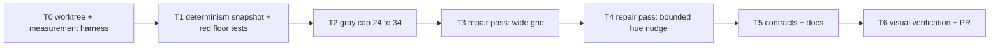

# Edge Color Separation Floor Plan (#85)

> **For agentic workers:** REQUIRED SUB-SKILL: Use superpowers:subagent-driven-development to implement this plan task-by-task. Steps use checkbox (`- [ ]`) syntax. Read the Rulings section before starting; the floor policy was ruled on 2026-09-07 after measurement and is final for this plan.

**Goal:** No two items in the same family read as one color on the canvas. The four pairs the issue names (`gas_copper` / `gas_copper_enr`, `copper_ore` / `copper_cmpt`, `copper_nugget` / `gas_copper`, `originium_ore` / `originium_powder`) separate by a CIE76 delta-E of at least 15, the pack-wide map enforces a floor the tests can assert, and every item already clear of the floor keeps its exact current color.

**Architecture:** Keep the single pack-wide, plan-independent color map and its existing max-min placement pass. After it, add a repair pass: it walks pairs below the floor in placement order and re-places only the later-placed member, searching a widened saturation/lightness grid first and a bounded hue nudge second. The floor has two tiers, 15 inside the saturated band and 8 inside the near-gray band and for any cross-band pair. The gray band's saturation cap rises from 24 to 34 so its 61 items have room. On hue, the test contract drops exact equality for a bounded distance from the icon hue.

**Tech stack:** TypeScript, vitest, small `bun --smol` measurement scripts, the visual verification protocol.

## Rulings

- **R1 - Global floor, not per-plan, not a non-color channel (2026-09-07).** Colors stay stable across plans. Dash and glyph shape keep encoding transport kind only.
- **R2 - Two-tier floor: saturated 15, gray 8 (2026-09-07).** Measurement showed a uniform 15 is unreachable (ceiling 13.65 even with the gray band deleted). The saturated band reaches 15 with a widened grid plus a hue nudge of at most 15 degrees; the gray band reaches 8 with its saturation cap raised to 34. Cross-band pairs take the gray floor.
- **R3 - Repair pass, not a re-run (controller call, 2026-09-07).** Any change to the grid or the objective reshuffles all 113 items because priors accumulate globally. The repair pass keeps every already-compliant item byte-identical and moves only offenders.
- **R4 - Hue nudge bound is 15 degrees, offenders only.** The hue contract becomes circular distance from the icon hue at most 15, with a pinned count of nudged items so a pack update cannot silently nudge everything.

## Evidence (develop@6706c7e)

- Icon hue is a precomputed per-icon hex converted at module load: `src/canvas/itemColor.ts:55-83` (`hexToHS`, integer hue, lightness discarded), `:88-93` (`iconHSById`).
- Placement: `packColorById` `:329-347` splits by `COLOR_SATURATION_MIN = 25` (`:46`), places the gray band first (`:340-343`), sorts by hue then id (`:286-288`, deterministic and plan-independent). Grid: `SAT_CANDIDATES` `:119`, `GRAY_CANDIDATES` `:120`, lightness 46..90 step 2 `:110-114`, `LIGHT_CAP` rationale `:107-109` (stale: no consumer is a light surface). Objective is max-min squared Lab distance to all priors `:289-321,339`. There is no floor in the implementation; the floor lives only in the test.
- Contrast: `floorLightness` `:255-261` lifts lightness until contrast >= 4.5 (`:129`) against `CANVAS_BG_HEX = #0f1114` (`:126`, single theme; `canvas.css:4`, no dark/light switch anywhere in `src`).
- Consumers all paint the color on near-black, none put dark text on it: stroke `src/canvas/ItemEdge.tsx:195,491`; chip border only `canvas.css:1715` (fill is a fixed dark gradient `:1714`); port glyph `src/canvas/PortGlyph.tsx:91`; row accent tab `RecipeNode.tsx:241,276` with `canvas.css:2071,2076`; loop ports `LoopNode.tsx:127,143` with `canvas.css:1246,1251`.
- Tests: `test/canvas/itemColor.test.ts:13` `MIN_DELTA_E = 6`; `:65-81` all-pairs floor; `:83-102` family pins; `:104-110` exact hue equality (the contract R4 loosens); `:138` legible-range guard `s >= 45 || s <= 24` (must admit the new gray cap); `:140` `l <= 90`. `itemColor.contrast.test.ts` and `portZoneDepth.test.ts:33,267` stay as they are. Fallback-path hsl pins at `:40-46` are not pack items and do not move.
- No color baselines elsewhere: component tests call `itemColor()` rather than literals; geometry-audit, placement-shots, chip-widths and `raw-and-transport.spec.ts:180` assert geometry or dasharray, not color. `docs/render-conventions.md:25` needs one sentence.
- Measurement (2026-09-07, scripts kept with the session): pack-wide min today 7.51; pairs under 10 / 12 / 15 / 20 = 68 / 142 / 290 / 598. Gray band: floor 8 unreachable for 8 items on the current grid, 0 with cap 34. Saturated band: floor 15 unreachable for 7 items on the current grid, 0 with the wide grid plus a 15-degree nudge. Achievable pack-wide minimum by policy: baseline 7.21, wide grid 7.60, gray cap 34 plus nudge 9.32, gray cap 45 plus nudge 10.70, bands merged 13.65.

## Global Constraints

- Branch `fix/edge-color-floor` off `develop`, worktree `STC/.claude/worktrees/fix/edge-color-floor/`. Never switch the main checkout.
- Nothing reaches GitHub except the PR. Read-only `gh` is fine.
- The contrast floor against the canvas background is inviolable; the repair search skips any candidate below it.
- Items already at or above their floor after the existing pass keep their exact hsl. The determinism snapshot (Task 1) is the proof.
- Hue moves only for offenders, at most 15 degrees, and only after the widened grid failed at the icon hue.
- No per-plan logic anywhere in the color path.
- ASCII-only comments. No external-doc references in comments or commit messages.
- 3.2 GiB box: wrap bun/vitest/playwright in `systemd-run --user --scope -q -p MemoryMax=2G -p MemorySwapMax=512M -- bun --smol ...`; vitest as ten sequential shards; one playwright spec per invocation for captures.
- Gates before "done" on any task: `bun run typecheck`, `bun run typecheck:tools`, `bun run lint`, sharded `bun run test`.

## Task order and dependencies

### Task 0: Worktree and measurement harness

- [x] Create the worktree and branch.
- [x] Add a small script under `tools/` that prints the pack-wide delta-E distribution, the per-band and cross-band minima, the list of pairs below each tier's floor, and the list of items whose hue differs from their icon hue with the distance. This is the ledger every later task reports against.

Gate evidence 2026-09-07: ledger on unchanged develop code prints min 7.51, pairs under 10/12/15/20 = 68/142/290/598, saturated min 11.31, gray min 7.51, cross min 11.74, 47 pairs below tier floors, 0 hue offsets, fingerprint ff166069. Gates: typecheck OK, typecheck:tools OK, lint OK, shards 1-10/10 green (139/152/298+1skip/132/111/152/185/128/221 passed).

**Acceptance:** the script reproduces today's numbers (min 7.51; 68 pairs under 10) on develop.

### Task 1: Determinism snapshot and red floor tests

- [x] Add a test that hashes the full sorted id-to-hsl map and pins it, with a comment saying a changed hash means a reshuffle and must be explained in the commit.
- [x] Split `MIN_DELTA_E` into a saturated-band floor of 15 and a gray/cross-band floor of 8, and have the all-pairs test classify each pair by band. Replace the exact-hue test with a bounded-distance test (15 degrees) plus a pinned count of nudged items.
- [x] Extend the legible-range guard to admit gray saturation up to 34.

Gate evidence 2026-09-07: snapshot pins fnv1a-32 ff166069 (same hash the ledger prints) and passes on unchanged code; the all-pairs floor test is red listing 47 violations, diffed pair-by-pair against the ledger's 47 (identical pairs, distances, floors; 28 saturated under 15, 19 gray under 8, 0 cross); family pins, hue-distance, nudged-pin (0), and legible-range tests green. Gates: typecheck OK, typecheck:tools OK, lint OK, shards 1-10/10 green except the one intended red in shard 7 ("keeps every pair of pack item colors perceptually distinct").

**Acceptance:** the floor tests fail listing exactly the pairs the Task 0 script lists; the snapshot test passes on unchanged code.

### Task 2: Gray band cap 24 to 34

- [x] Widen `GRAY_CANDIDATES` up to 34. This alone reshuffles the gray band, and through accumulated priors the saturated band placed after it, so record the new snapshot hash with the cause. It is the one accepted reshuffle in the plan.

Gate evidence 2026-09-07: ladder now [8,12,16,20,24,28,32,34]. Ledger: gray-band min 9.35, cross-band min 11.37, zero gray and zero cross offenders (floor 8 reached); 36 saturated pairs remain below 15 for Task 3; pack-wide min 9.35, hue moves still 0. Reshuffle recorded: fingerprint ff166069 -> 0d710d7f, 103 of 113 entries moved, 58 gray-band and 45 saturated-band, 10 unchanged (comment in the snapshot test states the cause). Gates: typecheck OK, typecheck:tools OK, lint OK, shards 1-10/10 green except the one intended red in shard 7 (36 saturated offenders).

**Acceptance:** the Task 0 script shows the gray-band and cross-band floor of 8 reachable with zero unreachable items; the saturated pairs below 15 are listed for Task 3.

### Task 3: Repair pass, widened grid

- [x] After the existing placement, iterate pairs below their floor in placement order. For the later-placed member, search a finer grid at its icon hue (saturation step 5, lightness step 1, lightness cap raised toward the contrast-safe maximum since no consumer is a light surface) for a point that clears the floor against all other items. Among the candidates that clear it, take the one with the largest minimum distance.
- [x] Repeat until no pair improves or a bounded number of sweeps completes; the pass must terminate and be deterministic.

Gate evidence 2026-09-07: repairOffendingPairs in src/canvas/itemColor.ts walks offender pairs in placement order (earliest later-member first), re-placing only the later member on the finer grid (saturations step 5 within the band, integer lightness 46..96, contrast floor respected via floorLightness). Map diff t2 -> t3: exactly 7 entries changed, every one the later-placed member of a t2 offender pair (verified by reconstructing placement order); non-offenders byte-identical. Ledger: saturated offenders 36 -> 26, gray/cross still 0, hue moves 0, fingerprint 0d710d7f -> 0720cd3b (re-pinned with cause; repeat run reproduces it). The lightness guard in the test now mirrors the repair ceiling 96 (one mover, plant_moss_1, sits at l=96). Gates: typecheck OK, typecheck:tools OK, lint OK, shards 1-10/10 green except the one intended red in shard 7 (26 saturated offenders needing the hue move).

**Acceptance:** snapshot hash changes only in offender entries (diff the map, not just the hash); the Task 0 script shows the remaining saturated offenders needing a hue move.

### Task 4: Repair pass, bounded hue nudge

- [x] For offenders the widened grid could not clear, extend the search to hue offsets up to 15 degrees in both directions, smallest offset first, same objective.
- [x] Record the final nudged-item list and pin its count in the Task 1 test.

Deviation recorded 2026-09-07: with the later-placed member as the only re-placement target, the pass stalls at 11 saturated pairs - every surviving mover is boxed in (no point within 15 degrees of its icon hue clears against the placement earlier movers took). The search therefore falls back to the pair's earlier member, same ladder (icon hue first), only when the later member has no eligible point at any allowed offset. Both members of a processed pair are offenders, so R3 (only offenders move) and R4 (icon hue first, bounded 15, nudged count pinned) hold; the plan's T3 wording said "only the later-placed member", and the fallback is the minimal completion that reaches the ruled floors.

Gate evidence 2026-09-07: ledger shows saturated-band min 15.02, gray-band min 9.35, cross-band min 8.02, zero pairs below their tier floor; hue moves 10 items, offsets 1-14 degrees (copper_cmpt -8, copper_enr -14, copper_enr2_cmpt -14, copper_nugget -5, copper_powder -12, equip_script_4_2 -7, gas_copper_enr -3, liquid_copper_enr +12, plant_bbflower_powder_1 +1, plant_moss_powder_1 +6), pinned with signed offsets in the test. Issue pairs: gas_copper/gas_copper_enr 16.95, copper_ore/copper_cmpt 69.39, copper_nugget/gas_copper 18.23, originium_ore/originium_powder 17.25. Map diff t2 -> final: 18 changed entries, every one a member of a t2 offender pair; non-offenders byte-identical. Fingerprint b577d038 (repeat run reproduces it). The legible-range guard became band-aware (colored band s >= 35, gray band s <= 34) because the repair grid places three saturated offenders at s 35-40. Gates: typecheck OK, typecheck:tools OK, lint OK, shards 1-10/10 all green (139/180/152/298+1skip/132/111/154/185/128/221).

**Acceptance:** all four issue pairs at or above 15; all-pairs floor tests green; nudged count pinned; every non-offender hsl identical to Task 2's map.

### Task 5: Contracts and docs

- [x] Update the stale `LIGHT_CAP` comment to say why the cap can sit near the contrast-safe maximum.
- [x] `docs/render-conventions.md`: one sentence that an item's hue may sit up to 15 degrees off its icon hue when the family would otherwise collide, and that gray families keep a saturation ceiling of 34.

Gate evidence 2026-09-07: LIGHT_CAP comment rewritten (no light-surface consumers; ceiling is hue legibility, not contrast; placement cap 90 keeps the shipped placement byte-identical while the repair grid reaches REPAIR_LIGHT_CAP 96). render-conventions.md gained one sentence in the Edges section; no other doc changes. Gates: typecheck OK, typecheck:tools OK, lint OK, shards 1-10/10 all green (139/180/152/298+1skip/132/111/154/185/128/221).

**Acceptance:** typecheck, lint, sharded tests green; no other doc changes.

### Task 6: Visual verification and PR

- [x] Visual verification protocol: default-plan captures, then zoomed before/after crops of gas-web (copper gases), multi6 (copper ore vs component), tundra (originium), battery5-xiranite; inspect for a nudged hue reading as the wrong family, not merely for presence.
- [x] Confirm geometry-audit, placement-shots, chip-widths and raw-and-transport are unmoved (colors are not part of their assertions).
- [ ] Open the PR to `develop` per `docs/pr-guideline.md`, body through the humanizer skill, carrying the Task 0 before/after ledger. Do not merge. -- SKIPPED by controller order (no push, no PR, no remote writes); every other T6 step ran.

Gate evidence 2026-09-07: captures under .artifacts/color-verify/{before,after}/ (gitignored) - default plan plus zoomed crops for all four named sites, before phase built with the develop itemColor, after phase with the branch's. Inspection (PNG pixel decode of every crop): copper strokes before cluster at hue 5-9 and after at 358-1 for nudged items while copper_ore stays at hue 6; originium holds 28/32; the xiranite crops are pixel-count identical before/after; whole-canvas hue distributions move only inside the copper/plant bands. No nudged hue reads outside its family band (max offset 14 degrees, warm-red span). e2e confirmations: geometry-audit 94 passed / 4 failed with exactly the adjudicated pre-existing develop failset (battery5-xiranite and multi6, both lane modes, same standing e:97 pierce) - recorded, not fixed; raw-and-transport 4/4; chip-widths 18/18; placement-shots baselines regenerated locally then verified 12/12 (determinism check, baselines are gitignored). Gates: typecheck OK, typecheck:tools OK, lint OK, shards 1-10/10 all green (139/180/152/298+1skip/132/111/154/185/128/221).

Final ledger (before -> after): pack-wide min 7.51 -> 8.02; saturated-band min 11.31 -> 15.02; gray-band min 7.51 -> 9.35; cross-band min 11.74 -> 8.02; pairs below their tier floor 47 -> 0; pairs under 10 68 -> 20; hue offsets 0 -> 10 items (copper_cmpt -8, copper_enr -14, copper_enr2_cmpt -14, copper_nugget -5, copper_powder -12, equip_script_4_2 -7, gas_copper_enr -3, liquid_copper_enr +12, plant_bbflower_powder_1 +1, plant_moss_powder_1 +6); fingerprint ff166069 -> b577d038. Issue pairs: gas_copper/gas_copper_enr 16.95, copper_ore/copper_cmpt 69.39, copper_nugget/gas_copper 18.23, originium_ore/originium_powder 17.25.

**Acceptance:** all gates green; ledger shows saturated min >= 15, gray and cross-band min >= 8, nudged items listed with offsets.

## Rebase onto develop (2026-09-12)

The branch was written against develop@6706c7e on recipe pack v1.4. It was rebased onto develop@2432b3d, which carries pack v1.5.3 (`e13773a`) plus the `iconIdForItem` indirection that routes an item's color through its icon id. The task records above are the v1.4 measurements as taken at the time and are left as-is; the numbers below are the same ledger re-run on v1.5.3.

The separation mechanism needed no change: `repairOffendingPairs` derives everything from the pack at module load, so the new colours flowed through it and the all-pairs floor test passed on the first run after the rebase. Only the two pinned values moved.

Re-measured ledger (develop@2432b3d -> branch, pack v1.5.3): pack-wide min 7.31 -> 8.12; saturated-band min 10.50 -> 15.03; gray-band min 7.31 -> 8.91; cross-band min 10.60 -> 8.12; pairs below their tier floor 24 -> 0; pairs under 10 62 -> 12; hue offsets 0 -> 10 items (copper_cmpt +11, copper_enr +5, copper_enr2_cmpt +4, copper_powder -13, crystal_enr +1, gas_copper -14, liquid_copper_enr +13, originium_ore +2, originium_powder +1, plant_moss_powder_1 -11), max offset 14 within the 15-degree cap; fingerprint 0cf3bd51. Issue pairs: gas_copper/gas_copper_enr 15.31, copper_ore/copper_cmpt 42.99, copper_nugget/gas_copper 15.40, originium_ore/originium_powder 33.38.

The 2026-09-12 re-verification measured five sub-floor pairs on multi6 under this policy (min 7.5). A pack-wide count of zero pairs below their tier floor covers them, since the map is plan-independent.

Conflict resolutions carried a fix of their own: the band lookup in the test helpers keyed on the item id, which v1.5.3 broke for the four renamed-icon items, so it now goes through `item.icon`. The legible-range guard became a per-band assertion because develop lowered the saturated bound to 35 while this branch raised the gray cap to 34 - a combined `s >= 35 || s <= 34` admits every saturation and asserts nothing.

Gates after the rebase: typecheck OK, typecheck:tools OK, lint OK, `vitest run` 158 files / 1795 passed, 1 skipped. Formatting is untouched; prettier reports pre-existing repo-wide drift on develop too (194 files there, 182 here).

## Non-goals

- Per-plan color re-spread, non-color family channels (rejected 2026-09-07).
- A uniform floor of 10 or 13 (rejected 2026-09-07 in favour of the two-tier floor).
- The "faint dark dotted sewage strokes at 0.75" bullet on #85: stroke weight and opacity, not color distance. Report as residue when closing.
- Any change to the contrast floor or to how transport kind is drawn.

## Closing #85

Close when Task 6 is merged, citing the ledger and the four pair distances, and recording the two residues: the gray band's floor is 8 by measurement, and the sewage-stroke weight item is separate.
