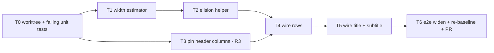

# Tail-Preserving Label Elision Plan (#84)

> **For agentic workers:** REQUIRED SUB-SKILL: Use superpowers:subagent-driven-development to implement this plan task-by-task. Steps use checkbox (`- [ ]`) syntax. Read the Rulings section before starting; all four were made on 2026-09-07 and are final for this plan.

**Goal:** Distinct item names must stay distinct after truncation on recipe cards, in all four locales, without depending on a within-card collision check. `Cuprium Bottle(Jincao Solution)` and `Cuprium Bottle(Yazhen Solution)` must never both render as `Cuprium Bott...`.

**Architecture:** On the three card surfaces (row label, card title, products subtitle), CSS tail ellipsis gives way to a pure elision helper that owns the visible string. The helper keeps a trailing balanced ASCII bracket group or a trailing token, head-truncates the base name, and puts the ellipsis in front of the preserved suffix. With no suffix, or with a head that would drop below a minimum, it falls back to plain tail ellipsis. The repo has no runtime text measurement, so a char-class upper-bound table estimates width against deterministic card geometry: rows already have a fixed budget, and pinning the card header's auto grid columns fixes the title and subtitle budgets too. The row-collisions e2e spec widens to the whole corpus, all locales, plan-wide.

**Tech stack:** TypeScript, vitest (unit, no layout), Playwright e2e (local only, not in CI), `canvas.css`.

## Rulings

- **R1 - Tail-preserving elision, plan-wide (2026-09-07).** The rule fires whenever a name has a distinguishing tail, whatever else is on screen. It is neither a set of curated short names nor a fallback that waits for a collision.
- **R2 - Tail rule only; no zh leading-prefix protection (2026-09-07).** zh marks tiers by a leading prefix (`优质`, `精选`) that tail preservation cannot protect. Those names are 4-6 characters and do not clip at card width today. Record the gap; do not build middle elision.
- **R3 - Pin the header grid columns (2026-09-07).** The card header's `auto 1fr auto` columns become constants so the title and subtitle budgets are deterministic. This also closes the #38 residual where the non-shrinking multiplier chip squeezed the title.
- **R4 - Test housekeeping (controller calls, 2026-09-07).** `test/e2e/title-truncation.spec.ts` becomes vacuous once the helper owns the string; delete it and move its issue references to the new unit test. `test/e2e/placement-shots.spec.ts` goldens change because label pixels change; re-record them in the final task as a deliberate, annotated re-baseline.

## Evidence (develop@6706c7e)

- In-scope render sites: row labels `src/canvas/RecipeNode.tsx:229,254` (input) and `:266,289` (output) under `src/canvas/canvas.css:2031-2039` (`overflow:hidden; text-overflow:ellipsis`) plus `:2020-2023` right-align; card title `.machine-title .cn` at `RecipeNode.tsx:131-135` under `canvas.css:2216-2221`; products subtitle `.rn-products` at `RecipeNode.tsx:139-141` (joined with an interpunct) under `canvas.css:2226-2245` (two-line clamp, `keep-all`).
- Out of scope, never truncate a name: `LoopNode.tsx:129,145` (wrapping flex), `ProductNode.tsx:157-158` (124px node, wraps), chips (`ItemEdge.tsx:678-694`, rate digits only; names on `aria-label`/`title`), panels and pickers (DOM, not canvas). Tooltips at `RecipeNode.tsx:254,289` keep the full string.
- Geometry: `.recipe-node` 300px at `canvas.css:1954-1963` (`src/canvas/dimensions.ts:14`), body `minmax(0,1fr)` twice at `:1974` so 150px per side; row padding and gap `:2000-2017`; icon 20px `:2025-2029`; `Sprite` returns null without an icon (`RecipeNode.tsx:34-35`), dropping 20px plus one gap; rate column `--font-num` 12px/700 at `:2041-2046`. Port glyphs and handles are absolutely positioned and cost no flex width. Net row budget is 150 minus fixed offsets minus the rate string, measured 65-83px by the #42 work.
- Header: `.rn-head` grid `auto 1fr auto` at `canvas.css:2091-2092`; icon block `:2098-2107`; recipe block padding `:2114-2121`; `.rn-mult-chip` `flex-shrink:0` at `:2128-2140`; rate figures `:2142-2151`.
- Measurement: no `measureText` or font-metrics table in `src/`. The only estimator is `src/canvas/chipSeating.ts:163-192` (`CHIP_GLYPH_PX` 7.5, an in-browser upper bound for ASCII digits at 11px/700, deliberately locale-blind at `:183-188`). DOM measurement exists only in test code: `test/e2e/row-collisions.spec.ts:36-52`, `tools/exam/probe.ts:573-585`, `test/e2e/chip-widths.spec.ts:87`. jsdom returns 0 for `scrollWidth` and bounding rects.
- Name grammar in `data/aef/recipe-pack.i18n.json`: parenthesis family (`copper_bottle-liquid_plant_grass_{1,2}`, `iron_bottle-liquid_plant_grass_{1,2}`) uses ASCII `(`/`)` in all four locales with no leading space; bracket family (`bottled_food_1..3`, `bottled_rec_hp_1..5`) uses space plus ASCII `[A]`/`[B]`/`[C]` in en and ru, a trailing Roman numeral with no bracket in ja, and a leading prefix in zh (R2).
- Existing guard: `test/e2e/row-collisions.spec.ts:11` covers `default` and `equip4` only, compares within one card, and is e2e (CI runs lint, typecheck, vitest, build only per `.github/workflows/ci.yml:41-56`). Prior art: `test/e2e/title-truncation.spec.ts:17-21`.
- Incidental, out of scope: `transfer_tundra_glass_bottle` and `glass_bottle` carry byte-identical names in all four locales (i18n lines 385/797/1209/1621 and `recipe-pack.json`). No elision rule can separate them; needs a data or naming decision of its own.

## Global Constraints

- Branch `fix/tail-preserving-elision` off `develop`, worktree `STC/.claude/worktrees/fix/tail-preserving-elision/`. Never switch the main checkout.
- Nothing reaches GitHub except the PR. Read-only `gh` is fine.
- The helper is pure and layout-free: string in, string out, with width supplied by an injectable estimator so unit tests can use a monospace stub.
- The estimator is an upper bound. Eliding slightly early is acceptable; overflowing into CSS ellipsis is not, because it recreates the defect.
- No `Intl.Segmenter`; code-point iteration suffices for the pack data (no combining marks or emoji).
- Chip seating, `chipSeating.ts` width constants and the geometry-audit baselines must be untouched.
- ASCII-only comments. No external-doc references in comments or commit messages.
- 3.2 GiB box: wrap bun/vitest/playwright in `systemd-run --user --scope -q -p MemoryMax=2G -p MemorySwapMax=512M -- bun --smol ...`; vitest as ten sequential shards; build once, `vite preview` in the background, one playwright spec per invocation.
- Gates before "done" on any task: `bun run typecheck`, `bun run typecheck:tools`, `bun run lint`, sharded `bun run test`.

## Task order and dependencies

### Task 0: Worktree and red tests

- [x] Create the worktree and branch.
- [x] Write a table-driven unit test for the helper over the five en families and their ru, ja and zh forms, using a monospace stub estimator: assert which substring survives at several budgets, that names without a suffix get plain tail ellipsis, and that when the suffix plus minimum head does not fit the helper returns the raw string.
- [x] Write a unit test for the estimator asserting it is at or above the in-browser numbers already recorded next to `CHIP_GLYPH_PX`, and that CJK and fullwidth characters count as one em.

**Acceptance:** both tests fail because the modules do not exist; nothing else changes.

- Evidence (T0): both new specs red on module resolution (vitest: 2 files failed, `Cannot find module '../../src/canvas/elide|textWidth'`); typecheck red on exactly those two TS2307s (expected red-by-design); typecheck:tools green; lint green. No other file touched.

### Task 1: Width estimator

- [x] Add a char-class width table (latin, Cyrillic, CJK/fullwidth, digits, punctuation, ellipsis) parameterised by font size and weight, in a new module under `src/canvas/`. It is an upper bound by design and documented as such in a source comment.
- [x] Do not touch `chipSeating.ts`; chips keep their own bound.

**Acceptance:** Task 0's estimator test passes.

- Evidence (T1): `src/canvas/textWidth.ts`; textWidth.test green (every digit at 11px/700 >= 6.89px, the number recorded next to CHIP_GLYPH_PX; CJK/fullwidth exactly one em at any size and weight). `chipSeating.ts` byte-identical to develop.

### Task 2: Elision helper

- [x] Suffix detection order: trailing balanced ASCII `(...)` or `[...]` group, else a trailing single token (last whitespace-separated word, or a trailing run of Roman numerals or Latin letters), else none.
- [x] With a suffix: keep it whole, head-truncate the base, place the ellipsis between base and suffix. Enforce a minimum head (four graphemes for Latin and Cyrillic, two for CJK); below that, return the raw string and let CSS tail ellipsis apply.
- [x] Without a suffix: return the raw string (CSS tail ellipsis stays the fallback).
- [x] Memoise by (string, budget bucket, font key); rows re-render on hover-dim and edges re-render per zoom tick, so the helper runs hot.

**Acceptance:** Task 0's family table passes across all four locales; the helper has no DOM dependency.

- Evidence (T2): `src/canvas/elide.ts`; elide.test 8/8 green (family table en/ru/ja/zh, raw fallbacks, pairwise-distinct families, memo bucket/font-key guards). Gates for the T1+T2 tree: typecheck OK, typecheck:tools OK, lint OK, vitest shards 1-10 all EXIT=0 (1703 passed, 1 skipped).

### Task 3: Pin header columns (R3)

- [ ] Replace the header's `auto` columns with fixed widths for the icon block and the rate figures; give the title a known width so `.rn-mult-chip` no longer competes. Record the constants next to `RECIPE_WIDTH` in `dimensions.ts`.
- [ ] Check the four locales on the default plan and the longest machine names for header regressions before moving on (captures per the visual verification protocol).

**Acceptance:** the title width is a constant derivable from `dimensions.ts`; `test/e2e/title-truncation.spec.ts` still passes at this point (it is deleted in Task 5).

### Task 4: Wire rows

- [ ] Compute the row budget in `RecipeNode` from the constants: half body width minus row padding and gap, minus the icon column when a sprite renders, minus the estimated rate string width. Over-estimating the rate string is the safe direction.
- [ ] Pass the helper's output as the visible label; keep `title=` on the full string.

**Acceptance:** a jsdom unit test renders the four bottle recipes and asserts the visible row strings differ; `test/canvas/node-name-tooltip.test.tsx` still passes.

### Task 5: Wire title and subtitle

- [ ] Title uses the pinned width from Task 3. Subtitle keeps its two-line clamp but each joined item name goes through the helper with the block's content width as budget, so a clamped second line still ends in a distinguishing tail.
- [ ] Delete `test/e2e/title-truncation.spec.ts` (R4); move its issue references into the Task 0 unit test description.

**Acceptance:** unit test asserting distinct visible titles for a colliding pair; the subtitle for a two-product recipe with both bottles shows both tails.

### Task 6: e2e widen, re-baseline, PR

- [ ] `test/e2e/row-collisions.spec.ts`: iterate the full scenario corpus and all four locales; lift the seen-map from per-card to per-page; remove the binary-search probe because `textContent` is now the visible string. Compare visible label plus rate per item id across the whole plan.
- [ ] Re-record `test/e2e/placement-shots.spec.ts` goldens (R4) with a NOTE naming this plan as the cause; confirm `test/e2e/chip-widths.spec.ts` and `test/e2e/geometry-audit.spec.ts` are unmoved.
- [ ] Visual verification protocol: default-plan captures plus zoomed crops of multi6 (the cross-card Packaging Unit pair), the bottled-food rotation plans, and one zh capture of the parenthesis family.
- [ ] `docs/render-conventions.md`: one sentence on the elision rule (tail preserved, ellipsis before it, plain tail ellipsis otherwise) and the zh prefix gap.
- [ ] Open the PR to `develop` per `docs/pr-guideline.md`, body through the humanizer skill. Do not merge.

**Acceptance:** all gates green; the widened collisions spec passes in four locales; geometry-audit and chip-widths unchanged; placement-shots re-baselined with annotation.

## Non-goals

- Curated short names, collision-triggered fallbacks, middle elision for zh prefixes (rejected 2026-09-07).
- Chips, loop nodes, product nodes, panels, pickers: none truncate item names.
- The identical-name pair `transfer_tundra_glass_bottle` / `glass_bottle`: a data defect, not an elision one. Report it separately; do not fix here.
- ResizeObserver-driven budgets: rejected in favour of deterministic geometry.

## Closing #84

Close when Task 6 is merged, citing the widened plan-wide spec and the unit family table, and noting the zh tier-prefix gap and the identical-name pair as recorded residues.
