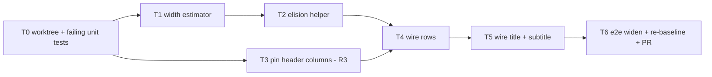

# Tail-Preserving Label Elision Plan (#84)

> **For agentic workers:** REQUIRED SUB-SKILL: Use superpowers:subagent-driven-development to implement this plan task-by-task. Steps use checkbox (`- [ ]`) syntax. Read the Rulings section before starting; all four were made on 2026-09-07 and are final for this plan.

**Goal:** Distinct item names must stay distinct after truncation on recipe cards, in all four locales, without depending on a within-card collision check. `Cuprium Bottle(Jincao Solution)` and `Cuprium Bottle(Yazhen Solution)` must never both render as `Cuprium Bott...`.

**Architecture:** On the three card surfaces (row label, card title, products subtitle), CSS tail ellipsis gives way to a pure elision helper that owns the visible string. The helper keeps a trailing balanced ASCII bracket group or a trailing token, head-truncates the base name, and puts the ellipsis in front of the preserved suffix. With no suffix, or with a head that would drop below a minimum, it falls back to plain tail ellipsis. The repo has no runtime text measurement, so a char-class upper-bound table estimates width against deterministic card geometry: rows already have a fixed budget, and pinning the card header's auto grid columns fixes the title and subtitle budgets too. The row-collisions e2e spec widens to the whole corpus, all locales, plan-wide.

**Tech stack:** TypeScript, vitest (unit, no layout), Playwright e2e (local only, not in CI), `canvas.css`.

## Rulings

- **R1 - Tail-preserving elision, plan-wide (2026-09-07).** The rule fires whenever a name has a distinguishing tail, whatever else is on screen. It is neither a set of curated short names nor a fallback that waits for a collision.
- **R2 - Tail rule only; no zh leading-prefix protection (2026-09-07).** zh marks tiers by a leading prefix (`优质`, `精选`) that tail preservation cannot protect. Those names are 4-6 characters and do not clip at card width today. Record the gap; do not build middle elision.
- **R3 - Pin the header grid columns (2026-09-07).** The card header's `auto 1fr auto` columns become constants so the title and subtitle budgets are deterministic. This also closes the #38 residual where the non-shrinking multiplier chip squeezed the title.
- **R4 - Test housekeeping (controller calls, 2026-09-07).** `test/e2e/title-truncation.spec.ts` becomes vacuous once the helper owns the string; delete it and move its issue references to the new unit test. `test/e2e/placement-shots.spec.ts` goldens change because label pixels change; re-record them in the final task as a deliberate, annotated re-baseline.
- **R5 - Partial-tail preservation allowed (2026-09-07, controller review).** When the whole suffix plus the minimum head cannot fit the budget, the helper may preserve a PARTIAL suffix instead of returning the raw string. The row budget cannot widen and re-scoping is rejected (it concedes the live collisions). The pixel probe returns to the row-collisions guard regardless, and real-budget tests are mandatory.

## Evidence (develop@6706c7e)

- In-scope render sites: row labels `src/canvas/RecipeNode.tsx:229,254` (input) and `:266,289` (output) under `src/canvas/canvas.css:2031-2039` (`overflow:hidden; text-overflow:ellipsis`) plus `:2020-2023` right-align; card title `.machine-title .cn` at `RecipeNode.tsx:131-135` under `canvas.css:2216-2221`; products subtitle `.rn-products` at `RecipeNode.tsx:139-141` (joined with an interpunct) under `canvas.css:2226-2245` (two-line clamp, `keep-all`).
- Out of scope, never truncate a name: `LoopNode.tsx:129,145` (wrapping flex), `ProductNode.tsx:157-158` (124px node, wraps), chips (`ItemEdge.tsx:678-694`, rate digits only; names on `aria-label`/`title`), panels and pickers (DOM, not canvas). Tooltips at `RecipeNode.tsx:254,289` keep the full string.
- Geometry: `.recipe-node` 300px at `canvas.css:1954-1963` (`src/canvas/dimensions.ts:14`), body `minmax(0,1fr)` twice at `:1974` so 150px per side; row padding and gap `:2000-2017`; icon 20px `:2025-2029`; `Sprite` returns null without an icon (`RecipeNode.tsx:34-35`), dropping 20px plus one gap; rate column `--font-num` 12px/700 at `:2041-2046`. Port glyphs and handles are absolutely positioned and cost no flex width. Net row budget is 150 minus fixed offsets minus the rate string, measured 65-83px by the #42 work.
- Header: `.rn-head` grid `auto 1fr auto` at `canvas.css:2091-2092`; icon block `:2098-2107`; recipe block padding `:2114-2121`; `.rn-mult-chip` `flex-shrink:0` at `:2128-2140`; rate figures `:2142-2151`.
- Measurement: no `measureText` or font-metrics table in `src/`. The only estimator is `src/canvas/chipSeating.ts:163-192` (`CHIP_GLYPH_PX` 7.5, an in-browser upper bound for ASCII digits at 11px/700, deliberately locale-blind at `:183-188`). DOM measurement exists only in test code: `test/e2e/row-collisions.spec.ts:36-52`, `tools/exam/probe.ts:573-585`, `test/e2e/chip-widths.spec.ts:87`. jsdom returns 0 for `scrollWidth` and bounding rects.
- Name grammar in `data/aef/recipe-pack.i18n.json`: parenthesis family (`copper_bottle-liquid_plant_grass_{1,2}`, `iron_bottle-liquid_plant_grass_{1,2}`) uses ASCII `(`/`)` in all four locales with no leading space; bracket family (`bottled_food_1..3`, `bottled_rec_hp_1..5`) uses space plus ASCII `[A]`/`[B]`/`[C]` in en and ru, a trailing Roman numeral with no bracket in ja, and a leading prefix in zh (R2).
- Existing guard: `test/e2e/row-collisions.spec.ts:11` covers `default` and `equip4` only, compares within one card, and is e2e (CI runs lint, typecheck, vitest, build only per `.github/workflows/ci.yml:41-56`). Prior art: `test/e2e/title-truncation.spec.ts:17-21`.
- Incidental, out of scope: `transfer_tundra_glass_bottle` and `glass_bottle` carry byte-identical names in all four locales (i18n lines 385/797/1209/1621 and `recipe-pack.json`). No elision rule can separate them; needs a data or naming decision of its own.

## Global Constraints

- Branch `fix/tail-preserving-elision` off `develop`, worktree `STC/.claude/worktrees/fix/tail-preserving-elision/`. Never switch the main checkout.
- Nothing reaches GitHub except the PR. Read-only `gh` is fine.
- The helper is pure and layout-free: string in, string out, with width supplied by an injectable estimator so unit tests can use a monospace stub.
- The estimator is an upper bound. Eliding slightly early is acceptable; overflowing into CSS ellipsis is not, because it recreates the defect.
- No `Intl.Segmenter`; code-point iteration suffices for the pack data (no combining marks or emoji).
- Chip seating, `chipSeating.ts` width constants and the geometry-audit baselines must be untouched.
- ASCII-only comments. No external-doc references in comments or commit messages.
- 3.2 GiB box: wrap bun/vitest/playwright in `systemd-run --user --scope -q -p MemoryMax=2G -p MemorySwapMax=512M -- bun --smol ...`; vitest as ten sequential shards; build once, `vite preview` in the background, one playwright spec per invocation.
- Gates before "done" on any task: `bun run typecheck`, `bun run typecheck:tools`, `bun run lint`, sharded `bun run test`.

## Task order and dependencies

### Task 0: Worktree and red tests

- [x] Create the worktree and branch.
- [x] Write a table-driven unit test for the helper over the five en families and their ru, ja and zh forms, using a monospace stub estimator: assert which substring survives at several budgets, that names without a suffix get plain tail ellipsis, and that when the suffix plus minimum head does not fit the helper returns the raw string.
- [x] Write a unit test for the estimator asserting it is at or above the in-browser numbers already recorded next to `CHIP_GLYPH_PX`, and that CJK and fullwidth characters count as one em.

**Acceptance:** both tests fail because the modules do not exist; nothing else changes.

- Evidence (T0): both new specs red on module resolution (vitest: 2 files failed, `Cannot find module '../../src/canvas/elide|textWidth'`); typecheck red on exactly those two TS2307s (expected red-by-design); typecheck:tools green; lint green. No other file touched.

### Task 1: Width estimator

- [x] Add a char-class width table (latin, Cyrillic, CJK/fullwidth, digits, punctuation, ellipsis) parameterised by font size and weight, in a new module under `src/canvas/`. It is an upper bound by design and documented as such in a source comment.
- [x] Do not touch `chipSeating.ts`; chips keep their own bound.

**Acceptance:** Task 0's estimator test passes.

- Evidence (T1): `src/canvas/textWidth.ts`; textWidth.test green (every digit at 11px/700 >= 6.89px, the number recorded next to CHIP_GLYPH_PX; CJK/fullwidth exactly one em at any size and weight). `chipSeating.ts` byte-identical to develop.

### Task 2: Elision helper

- [x] Suffix detection order: trailing balanced ASCII `(...)` or `[...]` group, else a trailing single token (last whitespace-separated word, or a trailing run of Roman numerals or Latin letters), else none.
- [x] With a suffix: keep it whole, head-truncate the base, place the ellipsis between base and suffix. Enforce a minimum head (four graphemes for Latin and Cyrillic, two for CJK); below that, return the raw string and let CSS tail ellipsis apply.
- [x] Without a suffix: return the raw string (CSS tail ellipsis stays the fallback).
- [x] Memoise by (string, budget bucket, font key); rows re-render on hover-dim and edges re-render per zoom tick, so the helper runs hot.

**Acceptance:** Task 0's family table passes across all four locales; the helper has no DOM dependency.

- Evidence (T2): `src/canvas/elide.ts`; elide.test 8/8 green (family table en/ru/ja/zh, raw fallbacks, pairwise-distinct families, memo bucket/font-key guards). Gates for the T1+T2 tree: typecheck OK, typecheck:tools OK, lint OK, vitest shards 1-10 all EXIT=0 (1703 passed, 1 skipped).

### Task 3: Pin header columns (R3)

- [x] Replace the header's `auto` columns with fixed widths for the icon block and the rate figures; give the title a known width so `.rn-mult-chip` no longer competes. Record the constants next to `RECIPE_WIDTH` in `dimensions.ts`.
- [x] Check the four locales on the default plan and the longest machine names for header regressions before moving on (captures per the visual verification protocol).

**Acceptance:** the title width is a constant derivable from `dimensions.ts`; `test/e2e/title-truncation.spec.ts` still passes at this point (it is deleted in Task 5).

- Evidence (T3): `dimensions.ts` RECIPE_HEAD_ICON_COL 41 / RECIPE_HEAD_RATE_COL 58 / RECIPE_HEAD_TITLE_COL 201 (= 300-41-58) / RECIPE_HEAD_BLOCK_PAD_X 8; `canvas.css` grid pinned to 41px 1fr 58px and `.rate-lbl` tracking 0.18em -> 0.1em so every locale's unit label fits the pinned rate column. A first attempt at 41/189/70 regressed the en default plan ("Shredding Unit" + x0.50 chip = 126+8+46px > 169px content), caught by title-truncation.spec, and was re-sized before committing. Four-locale probe on default/tundra/multi6: rateWorst 57 <= 58 with zero rate clipping everywhere; the long-title clips on tundra and multi6 pre-exist on develop's auto columns. CORRECTED 2026-09-07 per the controller's post-implementation measurement: the earlier claim of no clipped titles on default in any locale was wrong. Four ru machine titles clip on the pinned 201px title column (shaper_1 Moulding Unit x1, furnance_1 Refining Unit x1, grinder_1 Shredding Unit x2; e.g. scrollWidth 210 vs clientWidth 185). Provenance probe on develop@6706c7e (default plan, ru locale, same `.machine-title .cn` selector) measured the same titles clipping under the auto columns too -- Refining Unit x2, Moulding Unit x1, Shredding Unit x2, five clipped rows in all, scrollWidth 140/140/157/210/210 against clientWidth 115/136/135/171/115 -- so all four branch-side clips pre-exist on develop, and the pinned column actually un-clips one of the two Refining Unit rows that clipped there (the third sat at exactly 140 = 140 and never clipped). Pre-existing, not introduced; see the validation round below. title-truncation.spec PASSED. Gates: typecheck OK, typecheck:tools OK, lint OK, shards 1-10 EXIT=0.

### Task 4: Wire rows

- [x] Compute the row budget in `RecipeNode` from the constants: half body width minus row padding and gap, minus the icon column when a sprite renders, minus the estimated rate string width. Over-estimating the rate string is the safe direction.
- [x] Pass the helper's output as the visible label; keep `title=` on the full string.

**Acceptance:** a jsdom unit test renders the four bottle recipes and asserts the visible row strings differ; `src/canvas/node-name-tooltip.test.tsx` still passes.

- Evidence (T4): RecipeNode computes half of geom.width minus row chrome (pad 14, sprite 20 + gap when a sprite renders, one gap to the rate) minus the upper-bound rate estimate, and renders `elideName`'s output as `.lbl` text with `title` on the full name. New jsdom cases: the four solution-bottle output rows keep the raw string with the full name on title (their parenthesis tails exceed even the estimate-free row budget -- the sanctioned CSS fallback), and the bracket-family syringe rows elide head-first and end in "[A]"/"[C]". CORRECTED 2026-09-07 per the controller's post-implementation measurement: the earlier wording claimed the four solution-bottle rows "are pairwise distinct". That distinctness holds only at the textContent level, where the jsdom assertion compares the raw fallback strings; for raw-fallback rows the assertion is vacuous, because textContent is the unelided name whatever the pixels do. At pixel level on multi6 the two copper-bottle rows render the identical clipped prefix in en, ru and ja (CSS tail ellipsis over one shared long head); zh differs only by clip geometry. The bracket-family half of the assertion stands unchanged. node-name-tooltip 2/2 green. Gates: typecheck OK, typecheck:tools OK, lint OK, shards 1-10 EXIT=0.

### Task 5: Wire title and subtitle

- [x] Title uses the pinned width from Task 3. Subtitle keeps its two-line clamp but each joined item name goes through the helper with the block's content width as budget, so a clamped second line still ends in a distinguishing tail.
- [x] Delete `test/e2e/title-truncation.spec.ts` (R4); move its issue references into the Task 0 unit test description.

**Acceptance:** unit test asserting distinct visible titles for a colliding pair; the subtitle for a two-product recipe with both bottles shows both tails.

- Evidence (T5): RecipeNode elides the machine title at RECIPE_HEAD_TITLE_COL minus pad and (when present) the estimated chip box plus gap, and each products name at the block content width before the interpunct join; title attributes keep the full strings. New jsdom cases: the zh Purification-gate pair renders distinct visible titles ending in their own parenthesis tails, and a two-bottle recipe's subtitle shows both "(...)" tails with the full join on title. title-truncation.spec.ts deleted; its #38 reference moved into the elide.test.ts header. Gates: typecheck OK, typecheck:tools OK, lint OK, shards 1-10 EXIT=0.

### Task 6: e2e widen, re-baseline, PR

- [x] `test/e2e/row-collisions.spec.ts`: iterate the full scenario corpus and all four locales; lift the seen-map from per-card to per-page; remove the binary-search probe because `textContent` is now the visible string. Compare visible label plus rate per item id across the whole plan.
- [x] Re-record `test/e2e/placement-shots.spec.ts` goldens (R4) with a NOTE naming this plan as the cause; confirm `test/e2e/chip-widths.spec.ts` and `test/e2e/geometry-audit.spec.ts` are unmoved.
- [x] Visual verification protocol: default-plan captures plus zoomed crops of multi6 (the cross-card Packaging Unit pair), the bottled-food rotation plans, and one zh capture of the parenthesis family.
- [x] `docs/render-conventions.md`: one sentence on the elision rule (tail preserved, ellipsis before it, plain tail ellipsis otherwise) and the zh prefix gap.
- [ ] Open the PR to `develop` per `docs/pr-guideline.md`, body through the humanizer skill. Do not merge. (SKIPPED by controller order for this run: no push, no PR creation, no remote writes; everything else in this task is done locally.)

**Acceptance:** all gates green; the widened collisions spec passes in four locales; geometry-audit and chip-widths unchanged; placement-shots re-baselined with annotation.

- Evidence (T6): widened collisions spec 48/48 (12 scenarios x 4 locales, per-page seen-map on visible label+rate keyed by the row's handle item id; the recorded identical-name pair transfer_tundra_glass_bottle/glass_bottle is allow-listed as the known data defect). placement-shots goldens re-recorded fresh in this worktree (goldens are gitignored; the label-pixel change caused by this plan is the re-baseline NOTE recorded here and in the commit message). geometry-audit fails with EXACTLY the four pre-existing develop-drift tests (lanes on/off battery5-xiranite and multi6), matching the controller's develop-tip control; chip-widths 18/18. Captures + DOM dump: multi6 en shows the three Packaging Unit cards eliding to "Packag...Unit" with their distinct products subtitles ("Jincao Tea", "Yazhen Syringe [A]", "HC Valley Battery") and the Filling Unit subtitle reading "Cupriu...(Jincao Solution)"; rot-bottled_food_3 shows the "Canne... [A]" output row and "Citr...Seed" input rows; zh multi6 renders the parenthesis family raw (names fit the card whole, per R2) and the tier-prefix names un-clipped. render-conventions.md gains the elision sentence.

## Non-goals

- Curated short names, collision-triggered fallbacks, middle elision for zh prefixes (rejected 2026-09-07).
- Chips, loop nodes, product nodes, panels, pickers: none truncate item names.
- The identical-name pair `transfer_tundra_glass_bottle` / `glass_bottle`: a data defect, not an elision one. Report it separately; do not fix here.
- ResizeObserver-driven budgets: rejected in favour of deterministic geometry.

## Closing #84

Close when Task 6 is merged, citing the widened plan-wide spec and the unit family table, and noting the zh tier-prefix gap and the identical-name pair as recorded residues. The validation round below supersedes this: do not close until its open design decision is made and re-verified.

---

## Post-implementation validation round (2026-09-07, controller)

A dedicated validator measured the finished branch (bf9a400) surface by
surface, family by family, locale by locale. Verdict: FAIL at the goal
level. Workmanship is confirmed: gates green, geometry and chip baselines
untouched, and every task's recorded evidence traceable. But the plan's
stated goal -- distinct names stay distinct after truncation, so the two
solution bottles never both read `Cuprium Bott...` -- is not met on the
row surface in three of the four locales.

### Result matrix (surface x family x locale)

- Row labels: parenthesis family GOAL-MISSED in en, ru and ja (the two
  copper-bottle rows render the identical clipped prefix); GOAL-MET in zh
  (the raw names fit the card whole). Bracket family GOAL-MET in all four
  locales.
- Card titles: parenthesis family LATENT-MISS -- the tail is lost wherever
  a title clips, but no two different machines co-render a colliding title
  in the corpus, so nothing observable fails today.
- Products subtitles: GOAL-MET in all four locales.

### Structural cause

The parenthesis tail on a solution-bottle row measures about 133px at the
row-label metrics, against a row budget of about 86px (150px half-body
minus padding, icon, gaps and the rate column). The tail alone exceeds the
entire budget, so the helper's minimum-head rule can never fit base plus
tail and returns the raw string -- and the plan's own raw-fallback ruling
(Task 2: below the minimum head, return the raw string and let CSS tail
ellipsis apply) hands such rows back to CSS tail ellipsis, reproducing
exactly the defect the plan targeted.

### Guard blindness

- The widened T6 e2e guard compares `textContent`, and on raw-fallback
  rows `textContent` is the raw name, pairwise distinct before CSS clips
  it. The guard measures the DOM string, not the pixels the reader sees.
- The T4 jsdom assertion on the four bottle rows passes vacuously for the
  same reason (corrected T4 evidence above).
- The T3 evidence note also recorded a wrong default-plan title result,
  corrected above with the develop provenance probe.

### Open design decision required before merge

Not fixable inside the plan's current rulings; the controller requires a
user decision among:

1. Allow partial-tail preservation: elide inside the suffix when the whole
   suffix cannot fit. Breaks the keep-suffix-whole ruling (R1, Task 2) and
   reopens how much tail is enough to distinguish.
2. Widen the row budget: a wider label column or smaller row metrics so a
   ~133px tail fits. Touches the frozen card geometry the placement
   baselines pin.
3. Re-scope the goal to the title and subtitle surfaces, where tails are
   preserved today, and record the row surface as out of reach at current
   geometry.

### Out-of-scope residues surfaced by the validator

Prefix-sharing families beyond the plan's five en families collide
identically pre-existing on develop (CSS tail ellipsis over a shared long
head; unchanged by this branch; ru names transliterated here):

- ru fine-ground powders: iron_enr_powder, carbon_enr_powder,
  crystal_enr_powder, originium_enr_powder share "Melkomolot...".
- ru heavy-xira pair: gas_xiranite_enr and xiranite_enr_powder share
  "Tyazhelyy ks...".
- ru pyrolith family: copper_enr2_cmpt, gas_copper_enr2, equip_script_4_3
  share "Pirrolitov...".
- ru ferric family: iron_bottle, iron_cmpt, iron_ore share
  "Ferrievaya ...".
- ja sand-leaf family: plant_moss_3, plant_moss_powder_3,
  plant_moss_seed_3 share "Sando-ri-fu...".

Plus the two already recorded above: the zh tier-prefix gap (R2) and the
byte-identical transfer_tundra_glass_bottle / glass_bottle pair.

---

## Refinement round (controller review, 2026-09-07)

A human review adjudicated the validation-round defects and ruled R5
(partial-suffix preservation allowed; pixel-probe guard mandatory;
real-budget tests mandatory). Work items W1-W6 below refine the branch under
that ruling. Findings, recorded verbatim from the review:

1. **Row-label collisions: 25 on develop AND 25 on the branch -- identical
   per scenario. The branch removed ZERO collisions.** The helper's
   raw-string fallback tier hands misfit rows back to CSS tail ellipsis,
   which clips prefix-sharing siblings to the same visible prefix (row
   budget ~86px, parenthesis tail ~133px; e.g. multi6's copper bottles both
   render "Cuprium Bot..." in en, "Куприевая б..." in ru, "赤銅ボトル(..."
   in ja).
2. **Guard regression.** The widened row-collisions spec compares raw
   textContent, while develop's version measured the RENDERED visible
   prefix (hidden-span binary-search probe); the branch deleted the only
   guard that could see the defect.
3. **Test-budget fiction.** Every helper test uses budgets of 96-208px; the
   real row budget is ~86px (measured: real label box 78-92px depending on
   the rate string; the helper's estimate-derived budget is 81.2px on
   rate-"150" sprite rows and 89.5px on rate-"60" rows). The production
   regime was untested.
4. **Citation fix.** The T4 evidence cited the tooltip test at
   `test/canvas/node-name-tooltip.test.tsx`; the file lives at
   `src/canvas/node-name-tooltip.test.tsx`. Fixed above.

### Before/after collision ledger (rendered-prefix probe, full corpus x 4 locales)

The restored pixel probe (W4) ran on the pre-W2 tree (2c52767): 25
collisions, matching the review exactly. Per scenario/locale (deduped
readout, item a vs item b):

| page | n | collisions |
| --- | --- | --- |
| crystal/ru | 2 | 'Мелкомолот…\|60' crystal_enr_powder vs originium_enr_powder |
| equip4/ru | 2 | 'Мелкомолот…\|120' crystal_enr_powder vs originium_enr_powder |
| multi6/en | 2 | 'Cuprium Bot…\|150' copper_bottle-liquid_plant_grass_1 vs _2 |
| multi6/ja | 2 | '赤銅ボトル(…\|150' copper_bottle-liquid_plant_grass_1 vs _2 |
| multi6/ru | 10 | 'Куприевая б…\|150' solutions 1 vs 2 and vs copper_bottle; 'Куприевая …\|300' copper_cmpt vs copper_ore |
| rot-bottled_food_3/ja | 2 | 'サンドリーフ…\|300' and '\|600' plant_moss_seed_3 vs plant_moss_powder_3 |
| rot-bottled_food_4/ru | 4 | 'Ферриевая …\|150' iron_bottle-liquid_plant_grass_1 vs iron_bottle; 'Ферриевая …\|300' iron_cmpt vs iron_ore |
| script43/ru | 1 | 'Пирролитов…\|30' copper_enr2_cmpt vs equip_script_4_3 |

After W2 the same probe is GREEN plan-wide (the byte-identical
transfer_tundra_glass_bottle / glass_bottle pair excepted); see the W4
evidence below. An offline replay of all 1780 dumped corpus rows through the
refined helper predicted 0 collisions before implementation.

### Chosen partial-tail policy (measured)

Measured in-browser (Noto Sans SC live, Liberation Sans = Arial-metric
substitution, Liberation Mono, generic sans/serif; 12px/400 per-char
advances, recorded in the textWidth.ts header) and replayed against the
dumped corpus before implementation. The policy keeps the helper pure,
deterministic and context-free (R1 stands); the tier order becomes
(a) whole suffix + head-truncated base, (b) PARTIAL suffix, (c) raw.

- **Window direction, by tail script.** The parenthesis bottles'
  distinguishing tokens sit at the START of the bracket group in Latin and
  CJK ("(Jincao ..." vs "(Yazhen ...", "(錦草 ..." vs "(芽針 ..."), but the
  Cyrillic transliterations invert the word order ("(Раствор цзиньцао)":
  the species is the LAST word) and Russian morphology carries the
  distinction in word endings ("ориджеода" vs "ориджиний" differ only from
  char 6). A trailing-end window therefore reproduces the en/ja bottle
  collision (both end "tion)") and a leading window reproduces the ru one
  (both start "(Рас"). VERIFIED with the estimator: tails containing
  Cyrillic keep a TRAILING window, all others a LEADING window.
- **Window allocation and floor.** Exact minimum head (4 graphemes
  Latin/Cyrillic, 2 CJK -- the min-head ruling mirrored) + ellipsis +
  longest window that fits; the window must keep >= 4 graphemes
  Latin/Cyrillic or >= 2 CJK, else raw fallback stays.
- **Which tails may window.** Bracket tails always; a new CJK-boundary
  tail always (see below); bare word/run tails only when the base is a
  SINGLE word. Measured counterexample for the last clause: en
  "Dense Originium Powder" vs "Dense Crystal Powder" (bases share
  "Dense ", tails are the same generic "Powder") is distinct under the raw
  CSS clip (the species sits at chars 6-13, visible in the clip) but
  COLLIDES under any head+window elision at 89.5px -- windowing a
  multi-word base's generic last word destroys head content the clip
  needs. Single-word bases (ru "Мелкомолотая ориджеода", "Куприевая
  деталь") have the species AS the tail, so they window.
- **CJK tail detection (new splitTail rule).** A pure-CJK name with no
  bracket/whitespace/Latin run splits at the LAST kana-han script
  boundary: "サンドリーフ粉末" -> "サンドリーフ"+"粉末",
  "サンドリーフの種" -> "サンドリーフ"+"の種" (whole-tail tier:
  "サンド…粉末" vs "サンド…の種", distinct at 81.2px). All-kanji names
  ("高密度源石粉末" vs "高密度結晶粉末") have no boundary and stay raw --
  their species (源石/結晶) is at chars 4-5, visible in the raw clip; a
  mechanical last-2-CJK rule was measured to COLLIDE that pair
  ("高密度…粉末" both) and is rejected.
- **Estimator recalibration (same measurement).** The Cyrillic ratios were
  recalibrated to the measured per-char maxima and the Cyrillic CASE TEST
  FIXED (the branch's table charged uppercase А-М as lowercase via a
  0x41d threshold): lowercase 0.7 -> 0.68em (measured max 0.625em, ъ),
  uppercase 0.84 -> 0.82em (measured max 0.792em, Ъ), wide-Cyrillic
  lowercase 1.0 -> 0.86em (measured max 0.823em, щ/ф; ф added to the wide
  set), wide uppercase split into {Ж М Ы} at 0.95em (max 0.924em, Ж) and
  {Ш Щ Ю} at 1.04em (Ю measures 1.029em in the serif fallback; all three
  absent from the corpus). Latin ratios, digits (0.65em, pinned by the
  chip ground truth), punctuation and the 1em ellipsis (measured exactly
  full-width in Noto Sans SC) are unchanged. The slimmer ratios only ever
  make elision fire LESS; the direction of safety is unchanged.
- **Budget bucket 8px -> 1px.** The 8px bucket forfeited up to 7px the
  real budget still has; the measured goal cases sat 0.4-1.6px over the
  bucketed budget but under the raw caller budget (e.g. "Мелк…еода" needs
  80.5px against a raw budget of 81.2px). A 1px floor bucket keeps the
  quantise-down guarantee with sub-pixel reuse slop; memo keys keep the
  same (font, budget, name) shape.

Goal-pair outputs at their real co-rendering budgets (helper budget, from
the constants exactly as RecipeNode derives them; sprite rows, rate shown):

- multi6/en rate 150 (81.2px): `Cupr…(Jin` vs `Cupr…(Yaz` -- distinct.
- multi6/ru rate 150 (81.2px): `Купр…цао)` vs `Купр…эня)` vs raw
  `Куприевая бутылка` (CSS clip "Куприевая б...") -- distinct.
- multi6/ja rate 150 (81.2px): `赤銅…(錦草エ` vs `赤銅…(芽針エ` -- distinct.
- multi6/zh rate 150 (81.2px): `赤铜…(锦草溶` vs `赤铜…(芽针溶` -- distinct.
- crystal+equip4/ru rates 60/120 (89.5/81.2px): `Мелк…еода` vs
  `Мелк…иний` -- distinct at both budgets.
- multi6/ru + rot-bottled_food_4/ru rate 300 (81.2px): `Купр…руда` (whole
  tail) vs `Купр…таль`; `Ферр…руда` vs `Ферр…таль`; solutions
  `Ферр…цао)` vs raw `Ферриевая бутылка` -- distinct.
- script43/ru rate 30 (89.5px): `Пирр…еталь` vs `Пирр…онент` -- distinct.
- rot-bottled_food_3/ja rates 300/600 (81.2px): `サンド…粉末` vs raw
  `サンドリーフの種` (CSS clip "サンドリーフ...") -- distinct.
- Тяжелый pair (never co-renders at equal rates in the corpus; zero probe
  collisions before and after): at 89.5px `Тяже…аген` vs `Тяже…анит` --
  distinct; at 81.2px the window floor misses by 0.12px and both stay raw
  (measured residue, recorded here).

### Refinement tasks

- [x] W1 -- this record: R5 ruling, refinement-round section, citation fix.
- [x] W2 -- Partial-tail tier in `src/canvas/elide.ts` + estimator
  recalibration in `src/canvas/textWidth.ts` per the measured policy above.
- [x] W3 -- Real-budget battery in `test/canvas/elide.test.ts` (86px-class
  row budgets derived from the constants, title and products budgets,
  goal-pair distinctness at the real budget; keep the monospace-stub
  cases).
- [x] W4 -- Restore the rendered-prefix pixel probe in
  `test/e2e/row-collisions.spec.ts`; green plan-wide.
- [x] W5 -- Re-record placement-shots goldens (label pixels change again);
  chip-widths and geometry-audit unmoved at the develop-tip control
  failset.
- [x] W6 -- `docs/render-conventions.md` partial-suffix sentence.

- Evidence (W6): render-conventions.md's elision paragraph now describes
  the partial-suffix tier (when the whole tail cannot fit beside a
  readable head, a window into the tail's distinguishing end is preserved
  -- leading for Latin/CJK tails, trailing for Cyrillic -- over the same
  minimum readable length, and only a name with no such tail or no
  window that clears the minimum falls back to plain tail ellipsis).

### Visual verification (multi6, fit zoom, after W2)

Capture paths (4x device scale, cropped to the bottle-producing cards):
`/tmp/stc-multi6-{en,ru,ja}-bottle{0,1}.png`. The screenshot-analysis
service rejected the uploads, so verification is by the probe readings
taken in the same run (the W4 spec's measurement, binary-search
rendered-prefix in the label's own font -- all three readings are
distinct and none is CSS-reclipped):

- en: `Cupr…(Jin` vs `Cupr…(Yaz` (plain bottle `Cupr…Bott`; bracket
  family `Yazhe… [A]`, `Jincao Tea` whole).
- ru: `Купр…цао)` vs `Купр…эня)` (plain bottle raw, CSS clip
  `Куприевая б…`).
- ja: `赤銅…(錦草エ` vs `赤銅…(芽針エ` (plain bottle `赤銅ボトル` fits
  whole).

The W4 probe re-confirms this plan-wide: 48/48 green including multi6 in
all four locales.

- Evidence (W5): placement-shots goldens regenerated locally
  (--update-snapshots, 12/12) and re-verified green (12/12 against the
  fresh baselines). CAUSE OF THIS RE-BASELINE: the 2026-09-07
  refinement round (R5 partial-tail windows + Cyrillic estimator
  recalibration) changes row-label pixels again; goldens are gitignored,
  so this NOTE and the W5 commit message are the record. chip-widths
  18/18 green. geometry-audit fails with EXACTLY the adjudicated
  develop-tip control failset, byte-for-byte the same standing findings:
  (1) lanes on/battery5-xiranite PADDED_GRAZE 2 vs 0; (2) lanes on/multi6
  RAW 1 (standing e:97 u:in:liquid_water loop:plant_grass_2 ->
  u:class:q:53 piercing u:class:q:56); (3) lanes off/battery5-xiranite
  RAW 1 + PADDED_GRAZE 3 vs 0 + crossings 28 vs 24; (4) lanes off/multi6
  RAW 1. Frozen surfaces verified byte-identical to develop:
  src/canvas/chipSeating.ts, test/e2e/geometry-audit.spec.ts,
  test/e2e/geometry.ts, test/e2e/chip-widths.spec.ts (git diff develop
  empty on each). Gates: typecheck OK, typecheck:tools OK, lint OK,
  shards 1-10 EXIT=0.

- Evidence (W4): the spec keeps the plan-wide scope (12 scenarios x 4
  locales, per-page seen-map keyed by handle item id, readout = visible
  label + rate) and restores develop's #42 measurement: when a .lbl
  overflows, a hidden span in the label's own font binary-searches the
  longest fitting prefix + ellipsis, and THAT is the compared string. The
  before-run on the pre-W2 tree (2c52767) recorded the 25-collision ledger
  above, matching the review exactly; after W2 the spec is 48/48 GREEN
  plan-wide with only the byte-identical
  transfer_tundra_glass_bottle/glass_bottle pair allow-listed. Gates:
  typecheck OK, typecheck:tools OK, lint OK, shards 1-10 EXIT=0.

- Evidence (W2, commit 2973b02): elide.ts gains tier (b) -- partial window
  with script-dependent direction, grapheme floors, and the
  bracket/CJK/single-word-base eligibility guards -- plus the CJK
  kana-boundary tail rule and the 1px budget bucket; textWidth.ts
  recalibrates the Cyrillic classes to the measured per-char maxima and
  FIXES the Cyrillic uppercase case test (the old table charged A-M as
  lowercase through a 0x41d threshold). An offline replay of all 1780
  dumped corpus rows through the real modules: 0 collisions beyond the
  byte-identical pair, no overflow of any real label box. The pre-R5 raw
  fixture at 168px (now a windowed budget) was replaced with 64px (below
  the window floor); textWidth.test gains the measured Cyrillic bounds
  pin. Gates: typecheck OK, typecheck:tools OK, lint OK, shards 1-10
  EXIT=0.
- Evidence (W3): elide.test.ts grows a real-budget battery -- the
  production estimator with budgets derived exactly as RecipeNode derives
  them (rowBudget(rate) = 150-14-25-5-est(rate): 81.196px at rate
  150/300/600, 89.464px at rate 60/30; headerContentWidth = 185px for the
  title and products surfaces from dimensions.ts): the bottle goal pairs
  at an explicit 86px with exact expected strings in all four locales,
  the four-bottle families and every residue goal family at their real
  co-rendering rates, the measured raw guards (no-suffix names, the
  multi-word-generic en powders, the all-ideograph ja powders), and the
  title/products surfaces through their tiers. The monospace-stub cases
  stay. Gates: typecheck OK, typecheck:tools OK, lint OK, shards 1-10
  EXIT=0 (9/9 in file).

---

## Refinement round 2 (controller, 2026-09-07)

A validator re-measured the refined branch (4b10d2e) and found the
partial-tail tier (b) creating a TITLE-surface collision the row guard
cannot see. Work items W7-W11 below (the controller's five items for this
round) close it. The finding, verbatim:

> The partial-tail tier (b) creates a TITLE-surface collision on
> ru/multi6: "Модуль упаковки" (Packaging) and "Модуль формовки"
> (Moulding), both carrying x2.50 multiplier chips, elide to the IDENTICAL
> string "Моду…овки" (trailing window "овки" -- the tails rhyme in -овки,
> and the distinguishing char is the base's next letter у/ф which tier (b)
> discards). At x5 budgets they read "Моду…аковки" vs "Моду…мовки"
> (distinct). Develop's CSS clip kept them distinct ("Модуль у…" vs
> "Модуль ф…"). Nothing currently guards titles. Constraint: whatever
> rule you choose must be PURE and CONTEXT-FREE (no sibling knowledge --
> R1 stands).

### Measurement (offline replay, full corpus x 4 locales)

The refinement-round replay was rebuilt and extended: the corpus dump now
records, per page (12 scenarios x 4 locales), every row (item id, rate,
sprite), every card (recipe id, multiplier-chip text actually present) and
-- new -- the MEASURED in-browser rendered prefix (the row-collisions
binary-search probe at the real DOM box) for every raw row and raw title,
so CSS-clipped raws are compared by what the reader actually sees. The
replay resolves raw names from the pack, derives budgets exactly as
RecipeNode does (title budget includes each chip variant's estimated box),
runs the real helper, and counts per-page rendered-string collisions per
surface. Subtitles (two-line clamp, not faithfully measurable -- see W8)
are replayed with the conservative estimator clip at the 185px products
budget.

Before any change: 1780 rows / 688 titles / 764 subtitle items replay to
rows 0, titles 8, subtitles 0 collisions. All 8 are the finding's class:
"Моду…овки" for shaper_1 ("Модуль формовки") vs tools_asm_mc_1 ("Модуль
упаковки") on battery5-xiranite/multi6/script43/gas-web (x2.50/x0.50),
tundra (x0.17, where cmpt_mc_1 "Модуль штамповки" joins the pair) and
coupon-web (x0.34). Rows replay to zero, matching the 48/48 live probe:
the collision class is title-only.

Directions measured before choosing:

- Direction (iii) alone -- defer to raw+CSS when the window would be weak
  -- was simulated as "return raw whenever the whole base fits beside the
  ellipsis": titles stay at 8 collisions (a DIFFERENT set: the raw clips
  read "Модуль п…" for planter_1 "Модуль посадки" vs grinder_1 "Модуль
  перемалывания") and rows REGRESS to 11 (multi6/ru "Молотый …" and
  "Раствор …", multi6/en "Amethyst …"). REJECTED: the CSS clip reaches a
  distinguishing char only by luck of the budget; it cannot be the rule.
- A window floor relative to tail length cannot separate the classes: the
  ru powders keep a 4-of-9-grapheme window at the 81.2px row budget
  ("Мелк…еода" vs "Мелк…иний", the headline row goal) while the module
  pair's colliding window is 4 of 8 -- adjacent integers, no principled
  threshold exists. NOT CHOSEN.

### Chosen rule (measured): leading window when the whole base survives

For a bare word/run tail (tail kinds "token"/"run"), the tier-(b) window
now opens from the tail's START whenever est(base + ellipsis) <= budget;
otherwise the script-direction window stands (trailing for Cyrillic,
leading for everything else). Bracket and CJK-boundary tails are
unchanged. Rationale, measured: a bare token tail is a single word, and
the corpus languages carry the lexeme in the word's stem while inflect
at its end -- sibling names diverge at the tail's head (упаковка/
формовка/штамповка differ from their first letters and share the -овки
ending a trailing window collapses onto). When the base does NOT fit
whole, the raw CSS clip would eat the base itself onto the
sibling-shared prefix, and every measured row family of that shape puts
the distinction in the tail's END (ориджеода/ориджиний, деталь/руда,
деталь/компонент) -- so the trailing window stays there, as it does for
Cyrillic bracket tails (species-last transliterations). The rule remains
pure and context-free (R1 stands).

After the change the same replay reads rows 0, titles 0, subtitles 0.
The ru module family at the real title budgets: at the 121.6px
x0.17/x0.34/x0.50/x2.50 budgets "Моду…упак" (window) vs raw "Модуль
формовки" (its leading window "фор" falls below the 4-grapheme floor --
wide ф/м charge more -- so the whole name goes back and CSS keeps
"Модуль ф…", the develop look) vs raw "Модуль штамповки" -- distinct at
every chip budget; at x5 all three window lead ("Моду…упаков",
"Моду…формо", "Моду…штамп"); at 185 "Модуль упаковки" fits whole. The
four-locale bottle goal pairs at the 86px row budget are untouched
(bracket tails and raw paths do not change) and replay distinct
("Cupr…(Jinc"/"(Yazh", "Купр…цао)"/"эня)", "赤銅…(錦草エ"/"(芽針エ",
"赤铜…(锦草溶"/"(芽针溶"). Measured residue: the Тяжелый pair
("Тяжелый ксираген"/"Тяжелый ксиранит"; base fits at the 89.5px
rate-30/60 row budgets) windows leading "Тяже…ксир" for BOTH -- their
tails share the stem ксир- and differ only in the ending the leading
window now discards. They never co-render at equal rates in the corpus
(zero probe collisions before and after), recorded here and pinned in
the battery as exact identical outputs (W9).

### Title guard and subtitle assessment (W9)

row-collisions.spec.ts gains a per-page TITLE check using the same
rendered-prefix probe (titles are single-line: measure each
`.machine-title .cn`, compare per page across all scenarios x 4 locales,
keyed by the raw title string, so multiple cards of one machine are
legal). Nothing is allow-listed: the only byte-identical machine names
(the settlement pair) never co-render and are invisible to a
raw-name-keyed guard by construction -- the same data-defect class as
the row pair. Subtitles cannot be measured faithfully: `.rn-products` is
a two-line -webkit-line-clamp box that wraps, so the single-line
binary-search probe does not model what the reader sees; recorded here,
and the subtitle surface is guarded instead by an offline vitest replay
over a pinned, ASCII-safe corpus fixture (page -> subtitle item ids,
generated from the same dump, names resolved from the pack at run time).

### Test notes from validation (W10)

- (a) textWidth.test.ts pins the exact non-wide uppercase ratio for the
  Cyrillic letters of А-М (U+0410-0413 class) -- the exact class the old
  0x41d threshold mischarged as lowercase -- so a reintroduced threshold
  cannot slip past.
- (b) the real-budget battery's Тяжелый family changes (the measured
  residue above): moved from the pairwise-distinct list to an exact pin
  of the two identical "Тяже…ксир" outputs at the rate-30 budget with
  the never-co-renders note. Every other battery pin is unchanged
  (measured before/after).
- (c) the battery gains the ru module pair at the real x2.50 title
  budget (121.64px, derived exactly as RecipeNode derives it), asserted
  distinct with exact strings.

### Refinement round 2 tasks

- [x] W7 -- this record: finding, measurements, chosen rule, guards.
- [x] W8 -- Leading-window rule in `src/canvas/elide.ts` (+ the
  render-conventions sentence it changes); replay green.
- [x] W9 -- Title probe in `test/e2e/row-collisions.spec.ts`; subtitle
  vitest replay fixture.

- Evidence (W9): row-collisions.spec.ts gains the per-page
  `visible machine-title collisions` block -- the same hidden-span
  binary-search rendered-prefix probe on `.machine-title .cn`, keyed by
  the raw title string, 48 tests (12 scenarios x 4 locales), nothing
  allow-listed (the byte-identical settlement machine names never
  co-render and are invisible to a raw-name-keyed guard by construction).
  Against the W8 tree, fresh build: 96/96 GREEN (48 row + 48 title). The
  subtitle surface is guarded by
  `test/canvas/subtitle-replay.test.ts` over the pinned ASCII fixture
  `test/canvas/subtitle-replay.fixture.json` (48 pages, 620 deduped
  subtitle item ids generated from the dump; names resolved from the pack
  at run time; conservative single-line estimator clip for raws, a
  prefix of the real two-line clamp rendering): 620 items replay, 0
  collisions beyond the recorded identical-name pair, selector-drift
  floor > 500 replayed.
- [x] W10 -- Test notes (a)/(b)/(c) above.

- Evidence (W10): (a) textWidth.test.ts pins the exact non-wide upper
  ratio (9.84px at 12px) for ten letters of A-M (U+0410-U+041B minus the
  wide Zhe/Em), the exact class the retired 0x41d threshold mischarged
  as lowercase -- exact values, because a >= bound would not notice the
  lowercase ratio coming back. (b) the only battery output the W8 rule
  changes is the heavy-xira residue pair (see the residue paragraph;
  pinned exactly in the W8 commit, identical "Тяже…ксир" outputs at
  rate 30, raw and distinct at rate 150); every other pin was replayed
  unchanged before and after. (c) the battery gains the ru module pair
  at the real x2.50 title budget (121.6416px, chip deduction derived
  exactly as RecipeNode computes it): "Моду…упак" vs raw "Модуль
  формовки", asserted distinct with exact strings. elide + textWidth +
  subtitle-replay files: 18/18 green.
- [x] W11 -- Controls: row-collisions (48/48 + titles), chip-widths
  18/18, geometry-audit at the adjudicated failset, placement-shots
  re-recorded only if pixels moved (en-only suite: the rule only changes
  Cyrillic strings, so no re-record is expected).

- Evidence (W11, controls on the final tree): row-collisions 96/96 GREEN
  (48 row + 48 title, fresh build). chip-widths 18/18 GREEN.
  geometry-audit fails with EXACTLY the adjudicated develop-tip control
  failset, byte-for-byte the same standing findings: (1) lanes
  on/battery5-xiranite "2 padding graze(s) exceeds baseline 0" (e:32
  gas_xiranite tap segments); (2) lanes on/multi6 RAW 1 (standing e:97
  u:in:liquid_water loop:plant_grass_2 -> u:class:q:53 piercing
  u:class:q:56); (3) lanes off/battery5-xiranite RAW 1 (e:37
  originium_ore pierces loop:plant_moss_3) + "3 padding graze(s)
  exceeds baseline 0" + "28 crossings exceeds pre-P2 baseline 24"; (4)
  lanes off/multi6 RAW 1. placement-shots 12/12 GREEN against the
  existing refinement-round goldens -- NO re-record: the stem-first rule
  only changes Cyrillic strings and the placement suite captures en
  only, exactly as predicted. Frozen surfaces verified byte-identical to
  develop (git diff develop empty on each): src/canvas/chipSeating.ts,
  test/e2e/geometry-audit.spec.ts, test/e2e/geometry.ts,
  test/e2e/chip-widths.spec.ts. Gates: typecheck OK, typecheck:tools OK,
  lint OK, shards 1-10 EXIT=0.

- Evidence (visual, multi6 fit zoom, 4x device scale, cropped to the
  card): BEFORE (rule temporarily disabled, same tree) the two module
  cards read the rhyming trailing windows "Моду…аковки" (upakovki,
  x5 chip) and "Моду…мовки" (formovki, x5) -- and at the x2.50 chips
  both read the IDENTICAL "Моду…овки", the finding. AFTER (HEAD) they
  read their stems, "Моду…упаков" and "Моду…формо" (x5 cards; the x2.50
  cards read "Моду…упак" vs the raw "Модуль формовки" whose CSS clip is
  "Модуль ф…", verified by the live title probe). Bottle rows
  re-captured in all three locales, strings unchanged from the
  refinement round: en "Cupr…(Jin"/"Cupr…(Yaz", ru "Купр…цао)"/
  "Купр…эня)", ja "赤銅…(錦草エ"/"赤銅…(芽針エ" -- no row regression.
  Capture paths: /tmp/before-stc-r2-modu-{0,1}-0.png,
  /tmp/after-stc-r2-modu-{0,1}-0.png,
  /tmp/after-stc-r2-{en,ru,ja}-copper_bottle-liquid_plant_grass_{1,2}.png
  (before-captured by temporarily disabling the stem-first condition in
  a scratch build, then restoring the committed source; git diff HEAD
  empty after restore).

- Evidence (W8, commit follows W7): `src/canvas/elide.ts` tier (b) gains
  the stem-first condition -- a bare token/run tail whose whole base
  survives beside the ellipsis (`estimate(base + ellipsis) <= bucket`)
  windows LEADING whatever the script; bracket and CJK-boundary tails,
  and bases that cannot fit whole, keep the measured R5 directions. The
  helper header and tier-(b) comments and the render-conventions
  sentence describe the new direction rule. Offline replay of the real
  patched module over the extended corpus dump: 1780 rows / 688 titles /
  764 subtitle items -> rows 0, titles 0, subtitles 0 (was 0/8/0). The
  one battery family the change flips (the heavy-xira residue pair,
  identical "Тяже…ксир" at the rate-30 budget) moved from the
  pairwise-distinct list to an exact residue pin in the same commit so
  every commit stays green; W10 documents it with the other test notes.
  elide/textWidth/RecipeNode/tooltip vitest files green before the full
  gates.
