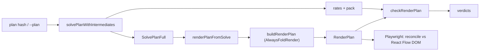

# Render-issue detection - design

Date: 2026-06-05
Branch: `feat/render-detection` (off `feat/lp-solver-refine`)
Related decisions: STC-0005 (LP rate solver), STC-0006 (blueprint tree rendering)

## Goal

Give the development loop a way to detect render-pipeline defects without a human
looking at the canvas. The motivating bug, RF-1, is structural: the solver is
provably correct (the intermediate item balances), but graph assembly drops an
internal edge, so a balanced intermediate surfaces as a phantom surplus product
and its downstream consumer renders with no input. This is the "passes all the
math, render is wrong" failure mode, and it is fully detectable by cross-checking
the rendered graph against the solve, the same way the solver already verifies
itself with reference-free invariants.

This builds the detector. It does not fix RF-1; RF-1 becomes a characterization
case that proves the detector works and will verify the eventual fix.

## Core principle

Check the final `RenderPlan` against the authoritative solve, never against a
render intermediate. The intermediates (logical graph, machine graph) can already
carry the bug, so trusting them would mask it. Everything the checkers need is
derivable from `rates: Map<RecipeId, Fraction>` plus `pack`, `targets`, and
`itemOverrides`: the same inputs the solver invariants use. Reuse the existing
`effectiveSupply`, `demandByItem`, and net-production helpers rather than
reinventing them.

This is the render mirror of `src/solver/invariants.ts`.

## Scope

Four components plus one supporting extraction.

1. Render-invariants module (the shared core).
2. CLI `--mode render` (the primary autonomous detection surface).
3. Render corpus test (regression gate, with RF-1 pinned as a characterization
   case).
4. Playwright DOM check (runtime-health surface, driven via the MCP).

Supporting: extract a `renderPlanFromSolve` helper shared by `App.tsx` and the
CLI so both build a `RenderPlan` from a `SolvePlanFull` the same way.

## Non-goals

- Fixing RF-1. The detector proves it and verifies its fix later.
- Pixel or screenshot golden-diffing. Deferred; the bug class here is structural.
- A dev-only in-path render assertion (the solver-style `import.meta.env.DEV`
  guard). Explicitly out for the first cut; can be added later if wanted.
- Checking `NoFoldRender`. The app uses `AlwaysFoldRender`; that is the target.
  `NoFoldRender` checking is optional and not built here.
- Committing the Playwright check as a CI e2e spec (pulls browser infra into CI).
  First cut is MCP-driven only.

---

## Component 1 - render-invariants module

`src/pipeline/render/invariants.ts`. Pure functions returning the existing
`InvariantResult` shape (`{ ok: boolean; violations: string[] }`). Truth is
derived from `rates` + `pack` + `targets` + `itemOverrides`.

### Checkers

1. `checkBoundaryProductsJustified`. Every input/output product unit must be
   justified by the solve:
   - input product for item X only when X has external supply (`effectiveSupply`
     is Infinity, or a finite positive cap) and the plan actually draws X;
   - target output only for a target item;
   - surplus output only when X has genuine net surplus
     (`production - consumption - demand > 0`) and X is disposable.
   A product unit for an internally-balanced intermediate (net residual near 0,
   not a target, not raw) is a violation. Catches RF-1's phantom surplus.

2. `checkInternalFlowConservation`. For each item produced and consumed
   internally, the total rendered internal-edge flow of that item (edges whose
   endpoints are both recipe or loop units) must reconcile with the solve's
   internal flow within tolerance. A missing internal edge under-carries.
   Catches RF-1's dropped internal edge.

3. `checkConsumerInputsSatisfied`. Every recipe unit at positive rate must, for
   each input item it consumes, have incoming flow (an internal edge or a
   boundary-input edge into it) totalling its intake
   (`executionRate * inQty`) within tolerance. Catches RF-1's consumer rendered
   with no input. Overlaps checker 2 on purpose: forward and reverse coverage,
   the same way the solver keeps separate forward and reverse representability
   checks.

4. `checkEdgeEndpointIntegrity`. Every edge `fromUnit`/`toUnit` resolves to a
   unit in `plan.units`, every `rate` is positive, every item exists in the
   pack. Structural sanity for dangling edges.

5. `checkNoOrphanUnits`. Every recipe unit maps back to a positive-rate recipe
   in the solve. Reverse direction, informational, mirrors
   `checkNoOrphanLogicalNodes`.

### Aggregators

- `checkRenderPlan(...) -> InvariantResult[]` for the CLI (collect all verdicts).
- `assertRenderInvariants(...)` throws one aggregated violation message for the
  corpus test.

### Loop / SCC units

`RenderUnitLoop` collapses an SCC; its internal cycle flows are hidden by design,
exposed only as net-IO ports. The checkers operate on a loop unit's net IO and
bias toward false-negative over false-positive, so the detector never reports a
violation on legitimately-hidden cycle internals. The corpus includes one SCC
plan to pin this behavior.

### Tolerance and conventions

Reuse `REL_TOL = 1e-6`, scaled by the magnitude of the compared quantity, exactly
as `checkMassBalance` / `checkRawOnlyBoundary` do. Exact `Fraction` arithmetic
for the sums; drop to `number` only at the final tolerance comparison.

---

## Component 2 - CLI `--mode render`

Extend `tools/solver-cli/main.ts`. The `--hash` / `--plan` decode and the solve
already exist. Add a render mode that runs `solvePlanWithIntermediates`, builds
the `RenderPlan` via `renderPlanFromSolve`, runs `checkRenderPlan`, and prints:

- units: id, kind, recipe or item, rate or multiplicity;
- edges: `from -> to`, item, rate;
- verdict blocks, reusing the existing formatter.

This is the primary autonomous tool:

```
bun run tools/solver-cli/main.ts --hash <h> --mode render
```

On a non-feasible solve it skips the render checks with a message, mirroring the
existing `--mode full` guard.

---

## Component 3 - render corpus test

`src/pipeline/render/render-corpus.test.ts`, mirroring the solver corpus.

- Known-good plans (the closed-form-fixture packs plus a few real-pack hashes):
  solve, build the render plan, `assertRenderInvariants` passes.
- RF-1 as a characterization case: assert the checker detects the violation on
  the RF-1 hash. This proves the detector catches the real bug without leaving
  CI red. When RF-1 is fixed, that assertion flips to passing, which doubles as
  fix verification.

Plus `src/pipeline/render/invariants.test.ts`: per-checker unit tests on
hand-built `RenderPlan` values. A good plan passes; a dropped edge or an injected
phantom product trips exactly the expected checker.

---

## Component 4 - Playwright DOM check

MCP-driven, no repo changes in the first cut. Boot the Vite dev server, navigate
to `http://localhost:5173/#<hash>` (the app reads the plan from
`window.location.hash`), wait for the React Flow renderer, then:

- compute the expected `RenderPlan` headlessly and reconcile the DOM
  `.react-flow__node` / `.react-flow__edge` counts against it (allowing for
  group / container nodes);
- assert no console errors and no React error boundary.

This catches drops introduced after the `RenderPlan`, in `layout.ts` / ELK (for
example an edge ELK cannot route being silently dropped). Promoting it to a
committed e2e spec is a deliberate later step.

---

## Supporting extraction - `renderPlanFromSolve`

`App.tsx` currently assembles the `RenderPipelineInput` (item and machine
lookups, overrides, targets) inline before calling `buildRenderPlan`. The CLI now
needs the same assembly. Extract a single helper
`renderPlanFromSolve(full, pack, targets, overrides) -> RenderPlan` (living
beside `buildRenderPlan` in `driver.ts`) and call it from both. One helper, two
callers, no behavior change.

## Data flow



## Testing strategy

- Per-checker unit tests: good case passes; a corrupted `RenderPlan` (dropped
  edge, phantom product) trips the right checker and only that checker.
- Corpus: known-good plans pass `assertRenderInvariants`; RF-1 is detected.
- CLI: a smoke test that `--mode render` on a known hash emits units, edges, and
  verdicts and exits cleanly.
- Existing suite stays green; the pre-existing `bun:test` extractor suite remains
  the only unrelated failure.

## Dependencies and sequencing

1. `renderPlanFromSolve` extraction (CLI and corpus both depend on it).
2. Render-invariants module + its unit tests.
3. CLI `--mode render`.
4. Render corpus test (depends on 1, 2).
5. Playwright DOM check (depends on the app running; independent of 2-4).

## Files

- New: `src/pipeline/render/invariants.ts`, `src/pipeline/render/invariants.test.ts`,
  `src/pipeline/render/render-corpus.test.ts`.
- Modified: `tools/solver-cli/main.ts` (add `--mode render`); `src/pipeline/driver.ts`
  (add `renderPlanFromSolve`); `src/App.tsx` (call the helper).
- Playwright: MCP procedure, no committed file in the first cut.

## Out of scope / carried forward

- RF-1 fix: fast-follow on its own branch; this detector verifies it.
- Dev-only in-path render assertion: optional later addition.
- Pixel / screenshot regression and a committed Playwright e2e spec: deferred.
- `NoFoldRender` checking: optional, not built here.
