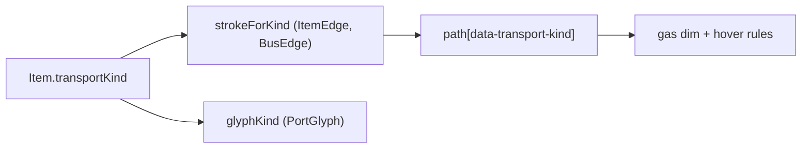

# Gas as a first-class transport kind

Status: approved 2026-07-25
Branch: `feat/gas-transport` (off `develop`)

## Problem

Game v1.4 introduced gaseous products and a gas pipe that carries them. The
recipe pack already contains the eight gas items (`gas_copper`, `gas_copper_enr`,
`gas_copper_enr2`, `gas_xiranite`, `gas_xiranite_enr`, `gas_water`, `gas_acid`,
`gas_inert`), but every one of them is classified `transportKind: "pipe"` because
the extractor's only rule is "no stack size means pipe". Consequences:

- The lane packer treats gas and liquid as one carrier, so a gas stream and a
  liquid stream in the same blueprint group share lanes that cannot physically
  be shared.
- Gas edges and gas ports render identically to liquid ones, so a reader cannot
  tell which physical carrier a line represents.

## Decisions

| # | Decision | Rationale |
|---|---|---|
| D1 | Gas is a full carrier: its own `transportKind`, its own pack `Transport`, its own `transport-config` carrier entry | Modelling gas as a render-only skin would leave lane packing wrong |
| D2 | Gas items are discriminated by the `gas_` id prefix | The vendor snapshot carries no phase field; the prefix split is exact today (8 gas, 11 liquid) |
| D3 | An unstackable item with an unrecognised prefix keeps falling back to `pipe` | Rejected failing the extract on drift: a hard throw would break the whole build on an upstream rename that only affects one item's stroke |
| D4 | Gas pipe throughput is 2 items/s per lane, flagged as an uncalibrated placeholder | The vendor snapshot has no gas pipe entry; reusing the liquid pipe figure keeps throughput behaviour unchanged so only bucketing moves |
| D5 | Gas line shape is dash-dot; gas port glyph is a hollow diamond | Belt is solid plus filled square, pipe is even-dash plus hollow circle; dash-dot and diamond stay distinguishable from both at fit zoom and at 8px |
| D6 | Gas gets its own dim and hover treatment rather than inheriting the shared edge rules | A dash-dot stroke degrades differently from a solid one under both opacity fade and stroke-width emphasis |

## Data layer

### Classification

`toItem()` in the extractor moves from a two-way to a three-way rule:

| Signal | Kind |
|---|---|
| `stack` is a number | `belt` |
| no stack, id starts with `gas_` | `gas` |
| no stack, anything else | `pipe` |

`TRANSPORT_KIND` in the extractor schema gains a `GAS` member. `TransportKindId`
stays an open string type, so no consumer needs a type change.

### Synthetic carrier

The vendor snapshot declares only `belt` and `pipe` transports, so the extractor
synthesizes the gas carrier:

- Appended to `pack.transports` as id `gas_pipe`, kind `gas`, speed 2, icon
  `pipe`. The append is what keeps the existing referential assertion ("every
  `Item.transportKind` resolves to a `Transport.kind`") true.
- Reusing the `pipe` icon id is safe because nothing in the app renders
  `transports[].icon`; the field is carried for completeness only.
- The i18n sidecar asserts a translation for every transport id in every locale,
  and upstream has no key for a synthetic id. The extractor injects the four
  locale names from a local table after the i18n split and before the coverage
  assertion, the same shape as the existing synthetic-item handling.

`data/aef/transport-config.json` gains a `gas` carrier pointing at
`transportId: "gas_pipe"` with `itemsPerSecondPerLane: 2`. The change is additive
and the config schema accepts any carrier key, so `schemaVersion` stays `0.2`.
The placeholder throughput is recorded in the existing `source` field alongside
the other uncalibrated values.

### Solver consequence

`ffdPack` buckets streams by `(blueprintGroupId, carrier)`. Splitting gas out of
`pipe` means a group producing both gas and liquid now packs two buckets where it
packed one, so lane counts rise in those groups. Per-lane capacity is unchanged,
so no rate or feasibility result moves. Pinned lane-count fixtures that shift get
re-pinned individually with a written justification, never in bulk.

## Render layer

### Line and glyph

- `strokeForKind` gains a `gas` branch returning a dash-dot `stroke-dasharray`.
  Stroke colour still comes from `itemColor(itemId)` exactly as belt and pipe do;
  only the no-item fallback colour is new, and it is a lighter cyan than the pipe
  fallback so the two read as related media of different density.
- `glyphKind` gains `"gas"`, rendered as a hollow 45-degree-rotated square tinted
  by `itemColor`. It is sized so its diagonal matches the pipe circle's footprint
  rather than exceeding it.

### Dim and hover

Both rules key off the `data-transport-kind="gas"` attribute that `ItemEdge`
already stamps on its `BaseEdge` path.

- Dimmed gas paths take an opacity floor above the shared edge value. At the
  shared value the dot segments of the pattern fall below visibility and the line
  reads as broken geometry rather than as a faded edge.
- Under `.hover-active`, the lit-edge rule multiplies stroke width. Dash arrays
  are expressed in user units and do not scale with stroke width, so the dots
  bloat into blobs at the emphasised width. The gas hover rule re-specifies a
  stretched dash-dot pattern so the shape identity survives emphasis.

## Acceptance criteria

1. `bun run extract` classifies all eight `gas_*` items as `gas` and every
   `liquid_*` item as `pipe`; no other item's kind changes.
2. The regenerated pack contains a `gas_pipe` transport of kind `gas`, and the
   i18n sidecar carries its name in all four locales.
3. `loadTransportConfig` accepts the regenerated pack without throwing
   `UnknownCarrierError`.
4. A blueprint group producing both a gas stream and a liquid stream packs them
   into separate lanes.
5. A gas edge renders with the dash-dot array and carries
   `data-transport-kind="gas"`; a gas port renders the diamond glyph.
6. Visual confirmation on a gas-bearing plan at fit zoom, hover-lit, and dimmed:
   gas lines are distinguishable from pipe lines in all three states, and the
   dash-dot pattern is legible in all three.
7. `bun run typecheck`, `bun run lint`, and `bun run test` are clean; any fixture
   re-pin carries a justification.

## Out of scope

- Calibrating the real gas pipe throughput. D4 stands until an empirical figure
  exists.
- Any gas-specific layout, routing, or bus behaviour. Gas rides the existing
  geometry.
- A gas icon of its own in the sprite sheet.

## Integration

`feat/gas-transport` rebases onto `develop` after the `fix/render-issues-2026-07-25`
campaign lands. Both touch `PortGlyph.tsx`, `ItemEdge.tsx`, and `canvas.css`;
re-applying one coherent change is cheaper than re-applying eight independent
fixes.
