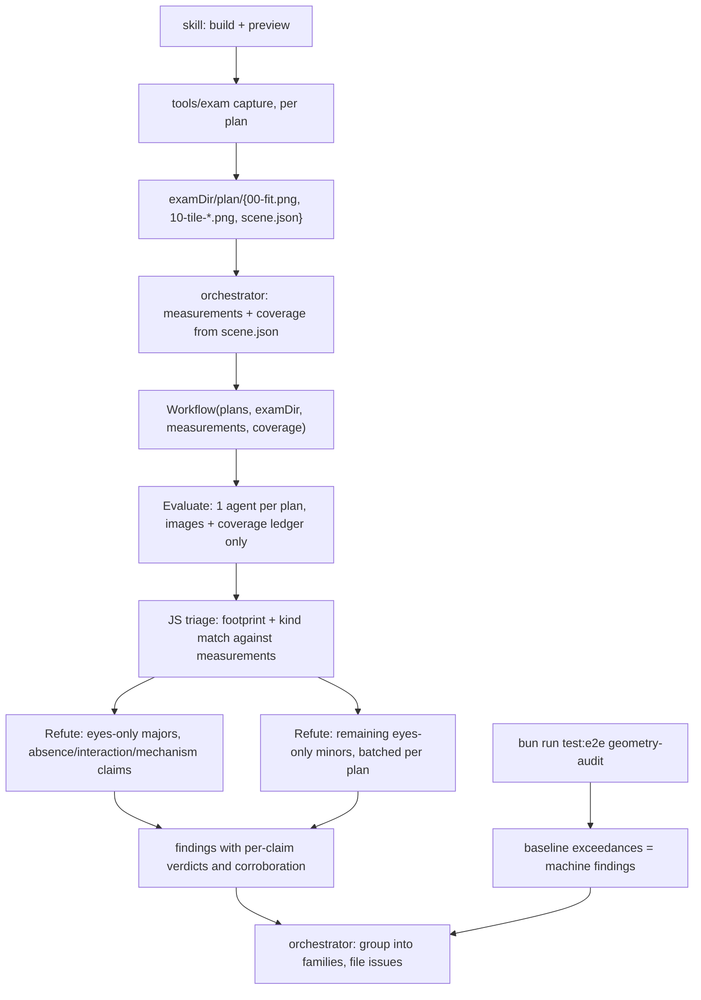

# Render-exam rework: frozen capture harness and refute phase

Design spec. Supersedes the current untracked exam procedure
(`.claude/skills/render-exam/SKILL.md`, `.claude/workflows/render-quality-exam.js`).

Lands on a branch off `develop`. Reviewed once by Codex (gpt-5.6-sol) as revision 1;
section 12 records the dispositions.

## 1. Problem

The render-quality exam is a multi-agent visual audit of the STC canvas: an Opus agent
writes Playwright and captures screenshots, an evaluator critiques them, the orchestrator
verifies and files issues.

| Run | Raw findings | Issues filed | Outcome |
| --- | --- | --- | --- |
| 2026-07-15 | ~25 | 12 (#10-#21) | all real, all eventually fixed |
| 2026-07-18 | 32 | 9 (#24-#32) | #27 and #30 closed as invalid premises; #28 and #32b filed with wrong mechanisms, corrected mid-campaign |

The 07-18 run spent a fix campaign's triage budget disproving its own findings:

- #30 "edge hover produces no response" was a capture artifact. The agent hovered edges
  by element; Playwright targets the bbox centre, which for L/Z-shaped orthogonal edges
  lies off the sub-2px stroke on 58-76% of edges. A screenshot cannot distinguish "the
  app does nothing" from "my capture never engaged hover".
- #27 "no luminance floor" asserted a mechanism from pixels. `src/canvas/itemColor.ts`
  has had a 4.5:1 floor since 86c2921; sewage measures 6.54:1. The real defect was #29's
  gray-on-gray slab hug.
- #28 and #32b shipped real symptoms wrapped around wrong causes.

Two structural gaps behind them:

1. The exam judges pixels and never queries the DOM, though `test/e2e/geometry.ts`
   already measures chip and segment geometry against the live client rects.
2. Capture is an LLM task. Tile grids are not reproducible run to run, capture bugs
   masquerade as product defects, and coverage is asserted rather than checked.

## 2. Decisions

- **D1 - Capture is fully frozen.** No capture agent. Deterministic code produces the
  sweep. A constrained follow-up interface (`probe`) ships in the same harness, because
  the refute phase needs it anyway.
- **D2 - Harness home.** A bun CLI at `tools/exam/`, matching `tools/extractor`,
  `tools/oracle`, `tools/solver-cli`. In-page collection is shared with
  `test/e2e/geometry-audit.spec.ts` so the exam and the ratchets measure the same things.
- **D3 - The machine stream is measurements, not verdicts, and is withheld from the
  evaluator.** `scene.json` carries geometry measurements with footprints; it declares no
  defects (section 6). Measurements feed triage and refuters. The evaluator sees images
  only and judges cold.
- **D4 - Full pixel coverage at target zoom.** Tiling continues until every element that
  exists at target zoom appears fully inside the safe region of at least one tile. The
  ledger proves it. A tile cap produces a labelled partial capture, not a failure.
- **D5 - Refutation is corroboration-triaged.** Findings corroborated by a co-located,
  kind-compatible measurement skip individual refutation. Eyes-only majors, every absence
  or interaction claim, and every mechanism hypothesis get one refuter each, which must
  cite a probe command and its output. Remaining eyes-only minors get one batched sweep
  per plan. `UNCERTAIN` downgrades and flags for the human; it never silently drops a
  finding.
- **D6 - Claims are typed and verdicts are per-claim.** `observation` (required,
  pixel-grounded symptom) and `mechanismHypothesis` (optional) are verdicted separately,
  so "symptom real, cause wrong" - the shape of #27 - is expressible.
- **D7 - The app gains a camera hook for the exam.** `window.__stcExam`, live only when
  the URL carries `?exam=1`, providing `setViewport`, `fitView` and `contentBounds`. This
  is the one change to shipping application code, and it is what makes full coverage
  achievable (section 5).

## 3. Scope and sequencing

Two implementable phases. Phase 2 depends only on `scene.json` existing.

**Phase 1 - the harness.** `test/e2e/collect.ts`, `tools/exam/{capture,probe}.ts`, the
`?exam=1` app hook, `scene.json`, the coverage ledger, and the skill's procedure change.
Deliverable: a reproducible command that captures any plan and proves what it covered.

**Phase 2 - the workflow.** Rewritten `render-quality-exam.js`: Evaluate, JS triage,
Refute; the typed finding schema; per-claim verdicts.

Out of scope, though enabled: before/after tile diffing (exact once `setViewport` lands);
a default-locale (zh) pass; a committed plan corpus; numeric scorecards and trending;
feeding open issues to evaluators as a regression check; a sibling UX exam for panels and
flows.

## 4. Architecture

Workflow scripts have no filesystem or shell access; they can only spawn agents. Since
capture is deterministic code, capture runs from the skill's main session via Bash, and
the workflow begins at Evaluate.

**`test/e2e/collect.ts`** (new). Two parts, and the split matters for estimation:

- *Lifted verbatim:* `collectAudit` and `collectGeometry` move out of
  `geometry-audit.spec.ts` (defined at :115 and :561). Playwright serialises these
  function bodies, so the self-containment rule holds - helpers stay inlined inside each
  collector rather than becoming module-level shared functions (the spec notes this at
  :566). Behaviour-preserving for the audit spec.
- *Genuinely new:* the existing collectors cover `.react-flow__edge-path` (id + `d`),
  `.react-flow__node` rects, and `.flow-chip` boxes. They do **not** inventory bus bands
  (`src/canvas/BusBands.tsx`), junction dots, port glyphs (`src/canvas/PortGlyph.tsx`),
  group and loop extents, or stable ids for any of those. `scene.json` needs a new
  `collectScene` collector. This is not a pure extraction.

**`tools/exam/`** (new). A bun CLI driving `playwright` directly (not `@playwright/test`),
with `capture` and `probe` subcommands. Both require `--base-url` and fail fast when it
is not serving. The harness never builds or starts a server: the skill's step 1 does
`build` + `preview`, and Playwright's `webServer` owns port 4173 for the e2e suite.

**`.claude/workflows/render-quality-exam.js`** (rewritten). Evaluate, JS triage, Refute.



## 5. Deterministic capture

### 5.1 The camera hook

React Flow's zoom is d3-zoom on the pane; nothing is exposed on `window`, and writing the
CSS transform directly desyncs React Flow's store (chips counter-scale off the store's
zoom, so the LOD tier would lie). Wheel-only control has a harder limit: wheel zoom keeps
the world point *under the cursor* fixed, so it cannot translate the view. A world point
near the fit-view periphery can be kept visible but never framed - which is exactly what
corrective tiling for a boundary element requires.

So the app exposes, only when `?exam=1` is present:

```
window.__stcExam = {
  setViewport({x, y, zoom}),   // React Flow's imperative setViewport
  fitView(),
  contentBounds(),             // the app's own contentBounds(nodes, edges)
}
```

`contentBounds` already exists in `src/canvas/chipSeating.ts` and is what `Canvas.tsx:218`
feeds to `fitBounds` - node cards plus seated chip extents plus lane bands. Reusing it
means the exam frames exactly what the app considers content, with no second
implementation to drift.

The hook ships in the production bundle but is inert without the query param, exposes
camera control and a read-only bounds getter (no data mutation), and changes no
rendering. Gating it on a build flag was rejected: an exam build that differs from the
shipped bundle undermines the point of the exam.

URL form is `<base>/?exam=1#<planHash>` - the query precedes the fragment, and the plan
hash is unchanged.

### 5.2 Boot

Viewport 1920x1080, `deviceScaleFactor` 2, `addInitScript` sets `aef.locale` (default
`en`, overridable), `goto(url, {waitUntil:'load'})`, wait for
`.react-flow__node-recipe, .react-flow__node-loop, .react-flow__node-product` visible
(30s), wait for `.canvas-annot.bottom-right` to contain `READY`, `document.fonts.ready`,
settle. Console messages collected from first navigation. Mirrors
`placement-shots.spec.ts`, the settled recipe.

### 5.3 Coordinate contract

- All rects in `scene.json` are **CSS pixels** relative to the `.react-flow` element's
  top-left, not the browser viewport.
- Screenshots use `scale: 'css'`, so image pixels equal CSS pixels 1:1 despite
  `deviceScaleFactor: 2`. The device scale factor stays at 2 so text renders at retina
  quality for the evaluator; `scale: 'css'` only fixes the reported size.
- World coordinates appear only in `contentRect`, `worldRect` and edge path `d` strings,
  and are always labelled `world`.

### 5.4 Tiling, safe regions, and cost

Target zoom `zt` defaults to **0.75**. The LOD gates are `LABEL_MIN_ZOOM` 0.35 and
`CHIP_ICON_ONLY_MAX_ZOOM` 0.32, imported from `src/canvas/ItemEdge.tsx` rather than
hardcoded. 0.75 keeps chip text crisp at `deviceScaleFactor` 2 while costing materially
fewer tiles than 0.9.

`Canvas.tsx:471` renders React Flow's `<Controls>` always and `<MiniMap>` when
`nodes.length > 15` (`MINIMAP_MIN_NODES`). Both are screen-fixed panels that occlude pane
corners, so a world point can be inside the pane and still invisible in pixels. The
harness measures both panels' client rects at capture time and subtracts them, plus a
small rim inset, giving the tile's **safe region**. Coverage is judged against the safe
region, never the raw pane.

A tile covers `safeW/zt x safeH/zt` world units; step is `0.85 x tile` for 15% overlap;
rows and columns follow from `contentBounds()`. `setViewport` places each tile centre
exactly, so intended and achieved transforms agree; the achieved transform is still
recorded for provenance.

**Cost is real and is the price of D4.** Tile count scales as `(zt / fitZoom)^2`. Fit
zooms are recorded in the `ItemEdge.tsx:137-147` calibration comment:

| Plan | Fit zoom | Approx tiles at `zt` 0.75 |
| --- | --- | --- |
| default | ~0.76 | 1-2 |
| crystal | ~0.46 | ~6 |
| battery5-xiranite | ~0.28 | ~16 |
| multi6 | ~0.17 | ~36 |

One evaluator reads a plan's whole set; at roughly 2.8k vision tokens per 1920x1080
image, multi6 costs about 100k tokens of images. That is affordable for a single Opus
agent and is the deliberate trade for coverage that means something. The cap is therefore
**64 tiles per plan**, sized to leave headroom above multi6 rather than to bind on it.

### 5.5 Inventory at target zoom

Per-member rate chips do not mount below `LABEL_MIN_ZOOM` 0.35, and dense plans fit
between 0.17 and 0.28. A fit-view DOM walk cannot see most of what needs covering.
Sequence:

1. `contentBounds()` gives the world rect - available at any zoom, since it comes from
   layout data rather than mounted DOM.
2. Walk the grid at `zt`, collecting the DOM inventory at every tile.
3. Union the per-tile inventories: that is the element set that exists at `zt`.
4. Compute coverage over that union. Add corrective tiles centred on anything uncovered.
5. Repeat 3-4 until fixpoint or cap. Since LOD depends only on zoom and every tile shares
   `zt`, the element set is stable and this converges in one corrective round in practice.

### 5.6 Coverage rules

Point-like elements (chips, junction dots, port glyphs, node cards) must lie fully inside
one tile's safe region.

Extended elements (edge paths, bus bands, group slabs) can exceed a tile at `zt`, so they
require their entirety to be covered by the *union* of safe regions, with a **seam margin
of 64 CSS px**: a segment crossing a tile boundary must appear with at least that much
context on one side in some tile, so no feature is bisected at every tile edge where it
appears.

### 5.7 Cap and outputs

Hitting the cap sets `status: "partial"` and lists residual uncovered ids. Exit code stays
0 - a partially covered plan is still worth examining, provided the evaluator is told what
it did not see - but the skill must surface every partial plan to the human.

Outputs per plan in `<examDir>/<planId>/`: `00-fit.png` (the overview, whose LOD state
legitimately differs from the tiles), `10-tile-r<row>c<col>.png`,
`20-corrective-<elementId>.png`, and `scene.json`, which also carries the image manifest
so the manifest cannot drift from the data.

## 6. `scene.json`, and why it holds no verdicts

An earlier draft called `geometry.ts` output "violations" and proposed surfacing
uncorroborated ones as machine-found defects. That is wrong. The audit functions return
raw occurrences, and `geometry-audit.spec.ts` deliberately permits large nonzero counts
per scenario after written rulings: `PADDED_GRAZE_BASELINE` battery5-xiranite 14,
`CHIP_SEGMENT_BASELINE` battery5 29 and battery5-xiranite 23, `OWN_PIERCE_BASELINE`
battery5-xiranite 16, `CROSSING_BASELINE` multi6 415. Treating occurrences as defects
would re-file hundreds of accepted, individually-ruled conditions.

Therefore:

- `scene.json` carries **measurements**; naming and framing say so.
- **Machine findings come from the existing ratchets.** The skill runs `bun run test:e2e`
  for `geometry-audit.spec.ts` and reports baseline *exceedances*. That machinery already
  encodes every ruling; duplicating its judgment in the exam would fork the rulings.
- Measurements exist in the exam for two jobs only: corroborating an evaluator finding,
  and arming refuters.

```
{
  planId, hash, url, locale, status: "complete"|"partial",
  viewport: {width, height, deviceScaleFactor, screenshotScale: "css"},
  fit: {zoom, x, y}, contentRect: {world rect},
  targetZoom, lodGates: {labelMinZoom, chipIconOnlyMaxZoom},   // imported, not literal
  tiles: [{
    file, kind: "fit"|"tile"|"corrective", row, col,
    viewportTransform: {x, y, zoom},
    safeRegion: {x, y, w, h},                  // CSS px in image space
    overlayMasks: [{name, x, y, w, h}],
    elements: { [elementId]: {x, y, w, h} }    // CSS px within THIS image
  }],
  elements: { [elementId]: {kind, itemId?, label?, worldRect} },
  edges: [{id, source, target, itemId, d, stroke, strokeWidth}],
  chips: [{id, edgeId, text, worldRect, lodTier}],
  measurements: [{
    kind: "chip-off-own-path"|"chip-vs-card"|"segment-vs-card"|"own-card-pierce"|"chip-vs-segment",
    elementIds: [...], footprint: {world rect}, detail
  }],
  crossingCensus: {count},
  coverage: {targetZoom, coveredCount, uncovered: [{id, kind, reason}],
             correctiveTiles, capHit},
  consoleErrors: [...]
}
```

**Footprints.** Every measurement kind gets one, because corroboration needs location.
`SegmentViolation`, `OwnCardPierce` and `ChipViolation` already carry `seg`
(`geometry.ts:164,210,266`). `ChipCardViolation` (:366) carries only ids, so the footprint
is derived as the chip rect intersected with the card rect. `ChipOffPathViolation` (:465)
carries a distance, so the footprint is the chip rect. `countCrossings` (:130) returns a
bare number with no participating ids, so it cannot corroborate anything and is recorded
as a census, never as a measurement.

Deliberately absent: colour and contrast censuses. A refuter computes contrast or deltaE
on demand through `probe`, and #27 shows that a standing colour table invites
mechanism-guessing.

## 7. `probe` - the constrained follow-up interface

```
bun tools/exam/probe.ts \
  --base-url <url> --hash <hash> [--locale <loc>] \
  [--zoom <z> --center <wx>,<wy>] \
  [--op <name> --arg k=v ...] \
  [--eval <file.js>] [--shot <out.png>]
```

Named operations cover the recurring questions, so a refuter usually writes no code:

| op | answers |
| --- | --- |
| `hover-edge` / `hover-node` | does hover engage, and what dims |
| `contrast` | WCAG ratio of an element's stroke or fill against its backdrop |
| `delta-e` | perceptual distance between two items' colours |
| `chip-binding` | distance from a chip to its own edge path, and to the nearest other path |
| `rect` | an element's world and screen rects |
| `computed-style` | resolved styles for an element |
| `text-overflow` | whether an element's text is clipped or ellipsised |

**`hover-edge`.** `hover-active` is not on the hovered edge: `Canvas.tsx:438` puts it on
the `.ak-canvas-theme` container, and `dimmed` goes on the complement of the lit
ego-network. An empty complement is also not automatically a defect - hovering an edge
whose ego-network covers the whole graph legitimately dims nothing. The op therefore:

1. resolves an on-stroke point from the edge's interaction path via `getPointAtLength`
   samples mapped through `getScreenCTM` - never the element bbox centre, which is #30;
2. waits past the 150ms hover-intent delay (`Canvas.test.tsx:208`);
3. reports `hoverEngaged` (is `hover-active` on the container), the observed `dimmed` set,
   and the **graph-derived expected** complement computed from scene adjacency.

An absence claim about hover is then decidable: engaged with observed equal to expected
means the feature works; engaged with observed materially smaller than expected is a real
defect; not engaged is a capture miss.

**`--eval`** stays as an escape hatch, because #27's contrast question was unanticipated
by construction and a closed menu would have had no answer for it. It takes a file
exporting a single self-contained arrow function (no imports, no outer scope), runs after
the camera and hover steps, with a 5s timeout and a size-capped JSON-serialisable result
recorded verbatim in the verdict. Named ops are the default path.

## 8. Workflow phases and schemas

**Evaluate** - one agent per plan. Inputs: images and the coverage ledger. Not the
measurements, not previous findings, not the open-issue list.

```
{
  planId, overall, blindSpotsAcknowledged: bool,
  findings: [{
    id, title,
    observation,                       // required, pixel-grounded, symptom only
    claimType: "geometric" | "interaction" | "absence" | "subjective",
    evidence: [{image, rect: [x,y,w,h], where}],   // CSS px in image space
    severity: "major"|"minor"|"nit",
    aspect: "correctness"|"comprehension"|"ux",
    falsifier?: {op, args, expectedIfFalse},       // required unless subjective
    mechanismHypothesis?: string                   // requires its own falsifier
  }]
}
```

The falsifier requirement is conditional rather than universal. Demanding a runtime check
for "this braid is hard to follow" produces fabricated falsifiers, which is worse than
none. Required for `geometric`, `interaction`, `absence`, and for any
`mechanismHypothesis`; forbidden for `subjective`, which routes to a human ruling instead
of a refuter. A finding that claims a measurable property and cannot name a falsifier is
rejected back to the evaluator.

**JS triage** (no agents). Corroboration requires **both**:

1. *Co-location* - the measurement's footprint, projected into the cited tile's image
   space, intersects the evidence rect. Shared element id alone is not enough: a long edge
   can be measured at one end while the evaluator marks unrelated clutter hundreds of
   pixels away on the same edge.
2. *Kind compatibility* - a `chip-off-own-path` measurement can corroborate "this chip
   floats free of its line"; it cannot corroborate "these two items are confusable
   colours". A fixed claim-kind to measurement-kind table encodes this.

Routing:

- corroborated **and** `claimType == geometric` -> `CORROBORATED`, individual refutation
  skipped, both citations carried into the issue.
- `absence`, `interaction`, any `mechanismHypothesis`, or an uncorroborated `major` ->
  individual refuter.
- `subjective` -> no refuter; flagged for human ruling.
- remaining uncorroborated `minor`/`nit` -> the plan's batched sweep.

**Refute** - verdicts are per claim, because "symptom real, cause wrong" is the failure
this design exists to catch:

```
{findingId,
 observationVerdict: "CONFIRMED"|"REFUTED"|"UNCERTAIN",
 mechanismVerdict?:  "CONFIRMED"|"REFUTED"|"UNCERTAIN",
 probeCommand, probeOutput, reasoning, correctedObservation?}
```

A verdict without a probe command and its output is coerced to `UNCERTAIN`. A finding
with `observationVerdict: CONFIRMED` and `mechanismVerdict: REFUTED` is filed as a symptom
report with the mechanism stripped - what #27 should have been.

Agent budget on a 5-plan corpus: 5 evaluators, roughly 5-9 refuters, up to 5 batched
sweeps. Inside the medium workflow guideline now that capture agents are gone.

## 9. Error handling

- `--base-url` unreachable: exit non-zero before opening a browser.
- `READY` not reached within 30s: exit non-zero, plan dropped, skill reports which.
- Coverage cap hit: exit 0, `status: "partial"`, residual ids listed, skill surfaces it.
- Console errors: recorded in `scene.json`; the skill reports them. Today they land in
  free-text notes and nothing acts on them.
- Evaluator returns null: plan logged and skipped, no fabricated findings.
- Refuter returns null or omits probe output: verdict forced to `UNCERTAIN`. Never
  auto-confirm, never auto-drop.

## 10. Testing

- Pure functions get vitest units: tile grid from `(contentRect, targetZoom, safeRegion)`;
  point-like versus extended coverage including the seam margin; the triage join
  (footprint projection, rect intersection, kind-compatibility table).
- The collector extraction is verified by **measuring the e2e baseline on the branch point
  before the change and comparing after**. Do not assume all-green: `develop` carries
  known pre-existing e2e failures (the v1.4 RAW-pierce ruling, inputs-panel pins, a copper
  premise, plus a rotating placement-shots flake). The success criterion is an unchanged
  pass/fail set, not a green run.
- Smoke: capture the default plan; assert exit 0, `status: "complete"`, empty `uncovered`,
  non-zero element count, and every tile at zoom >= target. This covers one sparse plan
  only; dense-plan coverage behaviour is exercised by the first real exam run, which is a
  deliberate limitation rather than an oversight.

## 11. Acceptance criteria

1. `bun tools/exam/capture.ts` reproduces byte-identical tile geometry across two runs on
   the same commit (image bytes may differ by anti-aliasing; `viewportTransform` and
   `elements` rects must not).
2. Every exam plan captures with `status: "complete"` and an empty `uncovered` list, or
   the partial is surfaced with named residual ids.
3. `geometry-audit.spec.ts` shows the same pass/fail set before and after the collector
   extraction.
4. A finding whose `claimType` is `absence` cannot reach the issue-filing stage without a
   refuter verdict citing a probe command and its output.
5. Replaying the #30 scenario through `probe --op hover-edge` reports `hoverEngaged: true`
   on battery5-xiranite and multi6, demonstrating the harness distinguishes a capture miss
   from a product defect.

## 12. Review dispositions (Codex, revision 1)

| # | Finding | Disposition |
| --- | --- | --- |
| 1 | Raw audit output is not a defect inventory | Accepted, restructured. Measurements replace violations; machine findings come from the existing ratchets; crossings demoted to a census |
| 2 | Element-id overlap is not corroboration | Accepted. Corroboration needs footprint co-location plus kind compatibility, and only `geometric` claims may skip refutation |
| 3 | Fit-zoom inventory misses LOD-gated elements | Accepted. Bounds from `contentBounds()`, inventory unioned across tiles at target zoom, corrective pass to fixpoint |
| 4 | Not a pure extraction | Accepted. Section 4 separates the verbatim lift from the new `collectScene` work |
| 5 | Wheel-only camera cannot centre arbitrary points | Accepted. `window.__stcExam.setViewport` promoted to baseline; wheel convergence dropped |
| 6 | Coordinate systems unspecified | Accepted. CSS px throughout, rects relative to `.react-flow`, screenshots at `scale: 'css'` |
| 7 | Overlays occlude pixels; no seam margin | Accepted. Overlay masks measured and subtracted, safe region, 64px seam margin |
| 8 | Hover contract contradicts the implementation | Accepted. `hover-active` is on `.ak-canvas-theme`; observed dim set compared against a graph-derived expected complement |
| 9 | `REFUTED` cannot express "true symptom, false cause" | Accepted. Per-claim verdicts |
| 9b | Falsifier should not be required on every finding | Accepted with modification. Required for geometric/interaction/absence/mechanism; forbidden for subjective, which routes to human ruling |
| 10 | `--eval` reintroduces fragility | Partially accepted. Named ops are the default; `--eval` survives constrained, because #27's question was unanticipated by design |
| 11 | Cap handling contradicts itself | Accepted. `status: "partial"`, exit 0, surfaced by the skill; smoke-test limitation stated |
| 12 | LOD thresholds hardcoded | Accepted. Imported from `src/canvas/ItemEdge.tsx` |
